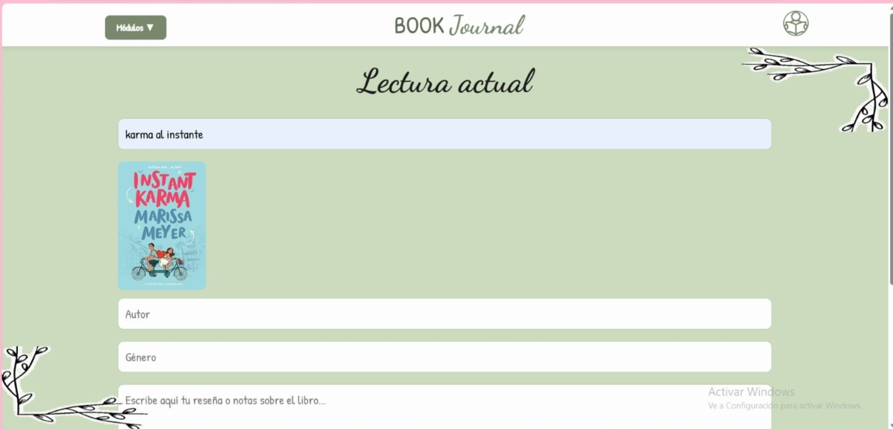
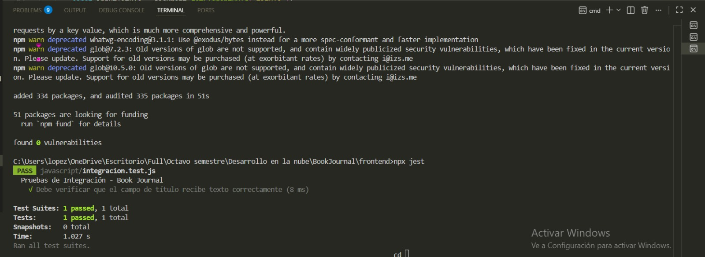

# BookJournal
## Índice
---

- 1. [Stack Tecnológico](#stack-tecnológico)

---

- 2. [Identificación, delimitación del problema dominio elegido](#identificación-delimitación-del-problema-dominio-elegido)

---

- 3. [Propósito de la aplicación](#propósito-de-la-aplicación)

---

- 4. [Alcance del sistema](#alcance-del-sistema)

---

- 5. [Funcionalidades principales](#funcionalidades-principales)

---

- 6. [Actores del sistema](#actores-del-sistema)

---

- 7. [Procesos clave](#procesos-clave)

---

- 8. [Distribución de tareas y roles del equipo](#distribución-de-tareas-y-roles-del-equipo)

---

- 9. [Roles del equipo](#roles-del-equipo)

---

- 10. [Distribución por fases](#distribución-de-tareas-y-roles-del-equipo)
    - 10.1. [Planificación](#1-planificación)
    - 10.2. [Configuración de base de datos](#2-configuración-de-la-base-de-datos)
    - 10.3. [Desarrollo del backend](#3-desarrollo-del-backend)
    - 10.4. [Desarrollo del frontend](#4-desarrollo-del-frontend)
    - 10.5. [Despliegue en la nube](#5-despliegue-en-la-nube)
    - 10.6 [Documentación](#6-documentación)

---

- 11. [Estructura del proyecto](#estructura-del-proyecto)

---

- 12. [Frontend](#frontend)
    - 12.1. [Descripción](#descripción)
    - 12.2. [Módulos](#módulos)
    - 12.3. [Componentes Compartidos](#componentes-compartidos)
    - 12.4. [Estilos CSS](#estilos-css)
    - 12.5. [Lógica JavaScript](#lógica-javascript)
    - 12.6. [Integracion de API para encontrar las portadas de los libros](#integracion-de-api-para-encontrar-las-portadas-de-los-libros)
        - 12.6.1. [Pruebas de integracion](#pruebas-de-integracion)
            - 12.6.1.1 [Configuracion del entorno para las pruebas](#configuracion-del-entorno-para-las-pruebas)
            - 12.6.1.2 [Detalle de las pruebas realizadas](#detalle-de-las-pruebas-realizadas)
            - 12.6.1.3 [Validación de entrada de datos](#validación-de-entrada-de-datos)
            - 12.6.1.4 [Procedimiento para la Ejecución de Pruebas](#procedimiento-para-la-ejecución-de-pruebas)

---

- 13. [Base de datos](#base-de-datos)
    - 13.1. [Arquitectura del sistema](#arquitectura-del-sistema)
    - 13.2. [Modelo de datos](#modelo-de-datos)
    - 13.3. [Configuración de la base de datos](#configuración-de-la-base-de-datos)
    - 13.4. [Configuración de seguridad](#configuración-de-seguridad)
    - 13.5. [Datos de prueba](#datos-de-prueba)
    - 13.6. [Ejecución completa](#ejecución-completa)
    - 13.7. [Buenas prácticas implementadas](#buenas-prácticas-implementadas)

---

- 14. [Despliegue frontend en Google Cloud](#despliegue-frontend-en-google-cloud)
    - 14.1. [Despliegue en hósting estático (GCP)](#-despliegue-en-hosting-estático-gcp)
    - 14.2. [Configuración de variables de entorno ](#️-configuración-de-variables-de-entorno)
    - 14.3. [Conectividad frontend](#️conectividad-frontend)
    - 14.4. [Conectividad Backend y Base de datos](#conectividad-backend-y-base-de-datos)
    - 14.5. [Consultas de verificación](#️consultas-de-verificación)
    - 14.6. [Buenas prácticas implementadas](#buenas-prácticas-implementadas)

---

- 15. [Despliegue local y en Google Cloud - Book Journal Back-endd](#despliegue-frontend-en-google-cloud)
    - 15.1. [Requisitos](#1-requisitos)
    - 15.2. [Estructura clave del proyecto](#2-estructura-clave-del-proyecto)
        - 15.2.1. [URLs de acceso después de desplegar](#21-urls-de-acceso-después-de-desplegar)
    - 15.3. [Configuración del datasource (variables de entorno)](#confihuracion-del-datasource-variables-de-entorno)
    - 15.4. [Dockerfile explicado](#4-dockerfile-explicado)
    - 15.5. [docker-compose.yml explicado](#5-docker-composeyml-explicado)
    - 15.6. [Pasos para desplegar en un nuevo equipo (modo Docker Compose)](#6-pasos-para-desplegar-en-un-nuevo-equipo-modo-docker-compose)
    - 15.7. [Variantes de despliegue](#7-variantes-de-despliegue)
        - 15.7.1. [Sin docker-compose (solo contenedor backend)](#71-sin-docker-compose-solo-contenedor-backend)
        - 15.7.2. [Importante en equipo nuevo](#72-importante-en-equipo-nuevo)
    - 15.8. [Verificación de integración con frontend](#8-verificación-de-integración-con-frontend)
    - 15.9. [Puntos de mejora para producción](#9-puntos-de-mejora-para-producción)
    - 15.10. [Comandos útiles](#10-comandos-útiles)

---

- 16. [Despliegue de Backend en Google Cloud Run](#despliegue-de-backend-en-google-cloud-run)
    - 16.1. [Flujo general](#flujo-general)
    - 16.2. [Paso a paso con explicación](#paso-a-paso-con-explicación)   
    - 16.3. [Tener en cuenta el ID del proyecto ya que sobre este se trabajara.](#tener-en-cuenta-el-id-del-proyecto-ya-que-sobre-este-se-trabajara)  
    - 16.4. [Resultado](#resultado) 
    - 16.5. [Flujo de actualización](#flujo-de-actualización)
    - 16.6. [¿Por qué usar Cloud Run?](#por-qué-usar-cloud-run)
    - 16.7. [Errores comunes](#errores-comunes)

---

- 17. [CI/CD BookJournal – Despliegue e Integración Continua](#cicd-bookjournal--despliegue-e-integración-continua)
    - 17.1. [Paso a Paso del Workflow](#paso-a-paso-del-workflow)
    - 17.2. [Seguridad Implementada](#seguridad-implementada)
    - 17.3. [Flujo Completo CI/CD](#flujo-completo-cicd)
    - 17.4. [Beneficios de la Implementación](#beneficios-de-la-implementación)

---

- 18. [Lecciones aprendidas](#lecciones-aprendidas)
    - 18.1. [Lecciones Aprendidas, Métricas y Reporte Final – BookJournal](#lecciones-aprendidas-métricas-y-reporte-final--bookjournal)
        - 18.1.1 [Experiencia y crecimiento técnico](#experiencia-y-crecimiento-técnico)
        - 18.1.2 [Buenas Prácticas Implementadas](#buenas-prácticas-implementadas)
        - 18.1.3 [Errores Cometidos](#errores-cometidos)
        - 18.1.4 [Oportunidades de Mejoras](#oportunidades-de-mejora)
    - 18.2. [Métricas del Proyecto](#métricas-del-proyecto)
    - 18.3. [Reporte Final del Proyecto](#reporte-final-del-proyecto)

---

- 19. [Historia de usuario](#historia-de-usuario)
    - 19.1. [Sprint 1 - Backend y Base de datos](#sprint-1---backend-y-base-de-datos)
        - 19.1.1. [Historia de usuario 1 - Gestión de usuarios en backend](#historia-de-usuario-1---gestión-de-usuarios-en-backend)
        - 19.1.2. [Historia de usuario 2 - Configuración de base de datos e integración](#historia-de-usuario-2---configuración-de-base-de-datos-e-integración)
    - 19.2. [Sprint 2 - Frontend](#sprint-2---frontend)
        - 19.2.1. [Historia de usuario 1 - Interaccion con frontend](#historia-de-usuario-1---interaccion-con-frontend)
        - 19.2.2. [Historia de usuario 2 - Eliminación de libros de la biblioteca](#historia-de-usuario-1---interaccion-con-frontend)
    - 19.3. [Sprint 3 - Despliegue Frontend](#sprint-3---despliegue-frontend)
        - 19.3.1 [Historia de usuario 1 - Despliegue de frontend en la nube](#historia-de-usuario-1---despliegue-de-frontend-en-la-nube)
        - 19.3.2 [Historia de usuario 2 - Despliegue del frontend en hosting estático](#historia-de-usuario-2---despliegue-del-frontend-en-hosting-estático)

---

- 20. [Métricas del Proyecto – Sprint 3 (Despliegue en la nube)](#métricas-del-proyecto--sprint-3-despliegue-en-la-nube)

---

- 21. [Reportes Visuales — GitHub Insights](#reportes-visuales--github-insights)

---
## Stack Tecnológico
1. Frontend: Maneja la lógica de interacción y estilos interfaz con el cliente.
    - Lenguaje base: HTML5 para la estructura de cada pagina (login.html, registro.html, perfil.html, edit_perfil.html, lista_deseos.html, lectura_actual.html y libros_leidos.html) y css3 para el diseño visual (login.css, registro.css, perfil.css, edit_perfil.css, lista_deseos.css, lectura_actual.css y libros_leidos.css).
    - Tipografía: Integración con Google Font (Dancing Script y Patrick Hand)
    - Lógica de interfaz: JavaScript, se encara de capturar los datos y actualizarlos por medio de clicks y envíos de formularios con datos  (login.js, registro.js, perfil.js, edit_perfil.js, lista_deseos.js, lectura_actual.js y libros_leidos.js)
    - Comunicación: Fetch api, actúa como el mensajero, es quien envía los datos desde los formularios hasta el backend. 

2. Backend: se encarga de procesar la lógica de negocio, gestionar la comunicación con la base de datos y garantizar la seguridad y autenticación de los datos del usuario.
    - Lenguaje: Java 
    - Framework principal: Spring Boot
    - Gestión de dependencias: Maven archivo pom.xml
    - Acceso a datos: Spring data JPA/ Hibernate, permite mapear las clases de java
    - Seguridad: Spring Security para manejo de sesiones.
    - Servidor embebido: Tomcat viene con Spring Boot para correr la aplicación.
    - Control para problemas de versiones: Se creo un Docker el cual permite que cualquier persona pueda ejecutar la aplicación sin problemas de versionamiento.

3. Base de datos: la información capturada por los formularios deja de estar solo en la aplicación y se guarda de forma permanente.
    - Motor de base de datos: PostgreSQL, para gestionar la base de datos relacionadas.
    - Lenguaje de consulta: SQL, creación de tablas, agregar registros nuevos (formularios de ingreso i edición de datos) y consultarlos (búsqueda en libros leídos).
    - Conexión red: La comunicación con el servidor se realiza mediante un túnel de datos dirigido al puerto 5432, garantizando un flujo de información constante y seguro.
    - Creación de instancia: Se configuró una instancia dedicada del motor de base de datos, proporcionando un entorno de ejecución aislado, estable y optimizado para el proyecto.

---

## Identificación, delimitación del problema dominio elegido
En la actualidad, muchas personas que tienen el hábito de la lectura no cuentan con una herramienta centralizada que les permita organizar, hacer seguimiento y evaluar su progreso lector de manera estructurada. Esto genera dificultades para recordar libros leídos, gestionar listas de lectura futuras y mantener un control sobre el avance personal.

En este contexto, surge la necesidad de desarrollar una solución tecnológica que permita gestionar de forma eficiente la información relacionada con la lectura personal, integrando funcionalidades básicas pero esenciales para el usuario.

El dominio de la aplicación corresponde a la gestión de biblioteca personal, abarcando entidades como usuarios, libros y listas de deseos. Este dominio fue seleccionado por su simplicidad y valor educativo, permitiendo implementar de manera clara patrones CRUD y principios básicos de diseño de software.

---

## Propósito de la aplicación
Book Journal es una API diseñada para facilitar la gestión de la lectura personal, permitiendo a los usuarios registrar, organizar y consultar información sobre libros leídos, en progreso o pendientes.

El propósito principal es proporcionar una base sólida para el desarrollo de aplicaciones que apoyen el hábito de la lectura mediante el uso de operaciones CRUD y buenas prácticas de desarrollo backend.

---

## Alcance del sistema
La aplicación se enfoca en un entorno de uso individual, donde cada usuario puede:
- Administrar su propia colección de libros
- Registrar su progreso de lectura
- Gestionar listas de deseos
- Evaluar y calificar libros leídos

El sistema está orientado a fines educativos y de aprendizaje, permitiendo implementar y comprender conceptos fundamentales como persistencia de datos, diseño de APIs y arquitectura backend.

---

## Funcionalidades principales
- Registro y autenticación de usuarios
- Gestión de libros (crear, consultar, actualizar y eliminar)
- Seguimiento del estado de lectura (pendiente, en progreso, leído)
- Calificación y valoración de libros
- Administración de lista de deseos

---

## Actores del sistema
- Usuario: Persona que interactúa con la aplicación para gestionar su información de lectura personal.

---

## Procesos clave
- Registro e inicio de sesión de usuarios
- Gestión del catálogo personal de libros
- Actualización del estado de lectura
- Organización de libros en listas (leídos y por leer)
- Consulta de información registrada

---

## Distribución de tareas y roles del equipo
Para el desarrollo del proyecto Book Journal, se definió una distribución de responsabilidades basada en roles específicos, permitiendo una ejecución organizada y eficiente en cada fase del desarrollo.

---

### Roles del equipo
- Líder de proyecto / Backend / Despliegue backend (Cloud Run)<br>
**Juan José Narváez Ortiz**<br>
Responsable de la planificación general, coordinación del equipo, desarrollo del backend y despliegue del servicio en la nube mediante Cloud Run.

- Frontend Developer<br>
**Laura Daniela López Santos**<br>
Encargada del desarrollo de la interfaz de usuario, consumo de la API y manejo de la interacción del sistema.

- Gestión de Base de Datos (Cloud SQL)<br>
**María Paula Riveros**<br>
Responsable de la creación, configuración y despliegue de la base de datos en Google Cloud SQL, así como la gestión de accesos y estructura de datos.

- Despliegue de Frontend (Cloud Storage)<br>
**Dayana Michelle Pulido**<br>
Encargada del despliegue del frontend utilizando servicios de almacenamiento en la nube, garantizando su disponibilidad y acceso.

---

## Distribución por fases
### 1. Planificación
Responsable: Juan José Narváez Ortiz
- Definir dominio de la aplicación
- Asignar responsabilidades

Responsable: María Paula Riveros
- Diseñar modelo de datos
- Crear diagrama entidad-relación

---

### 2. Configuración de base de datos
Responsable: María Paula Riveros
- Crear instancia PostgreSQL en Cloud SQL
- Configurar acceso y seguridad
- Crear base de datos y tablas
- Poblar con datos de prueba

---

### 3. Desarrollo del backend
Responsable: Juan José Narváez Ortiz
- Configurar proyecto Spring Boot
- Implementar modelos de datos
- Crear endpoints REST
- Configurar CORS
- Probar endpoints

---

### 4. Desarrollo del frontend
Responsable: Laura Daniela López Santos
- Crear estructura del proyecto
- Desarrollar formularios y vistas
- Manejar estados de carga y errores
- Realizar pruebas de integración

Responsable: Juan José Narváez Ortiz
- Implementar consumo de API

Tareas:
- Desplegar servicios
- Configurar variables de entorno
- Verificar conectividad

---

### 5. Despliegue en la nube
- Base de datos (Cloud SQL): María Paula Riveros
- Backend (Cloud Run): Juan José Narváez Ortiz
- Frontend (Cloud Storage): Dayana Michelle Pulido

---

### 6. Documentación
Responsables: Todos los integrantes
- Crear README completo
- Documentar API
- Incluir capturas
- Registrar video demostrativo

---

## Estructura del proyecto
```
    Book-Journal/
    ├── frontend/                   // Interfaz de usuario y lógica de cliente
    │   ├── html/                   // Vistas de la aplicación
    │   │   ├── login.html          // Acceso al sistema
    │   │   ├── registro.html       // Creación de nuevas cuentas
    │   │   ├── perfil.html         // Datos del usuario y configuración
    │   │   ├── lista_deseos.html   // Libros pendientes por leer
    │   │   ├── lectura_actual.html // Seguimiento del libro en curso
    │   │   ├── libros_leidos.html  // Historial y calificación (estrellas)
    │   │   └── home.html           // Pantalla principal / Dashboard
    │   ├── css/                    // Estilos visuales consolidados
    │   │   ├── estilos.css         // Archivo unificado de estilos
    │   │   └── componentes.css     // Estilos de cards, botones y estrellas
    │   ├── java-script/            // Lógica de interacción y consumo de API
    │   │   ├── login.js            // Validación y envío de credenciales
    │   │   ├── registro.js         // Lógica de creación de usuarios
    │   │   ├── historial.js        // Manejo de la lista de libros y estrellas
    │   │   └── api-config.js       // Configuración de Fetch y endpoints
    │   └── recursos/               // Activos estáticos y multimedia
    │       ├── Imagen1.png         // Decoraciones de libros
    │       ├── Imagen2.png         // Decoraciones laterales del diario
    │       └── icon-perfil.png     // Avatar por defecto del usuario
    ├── Book-Journal/
    ├── backend/                   // Código fuente en Java (Spring Boot)
    │   ├── src/main/java/com/bookjournal/
    │   │   ├── controllers/       // Endpoints REST (@RestController)
    │   │   ├── models/            // Entidades de base de datos (@Entity)
    │   │   ├── repositories/      // Interfaces para consultas SQL (JPA)
    │   │   ├── services/          // Lógica de negocio avanzada
    │   │   └── security/          // Configuración de filtros y JWT
    │   ├── src/main/resources/
    │   │   └── application.properties // Configuración de conexión a PostgreSQL
    │   └── pom.xml                // Dependencias de Maven
    ├── database/                   // Persistencia de datos (PostgreSQL)
    │   ├── scripts/                // Scripts de creación de tablas y datos iniciales
    │   │   ├── create_tables.sql   // Definición de tablas de usuarios y libros
    │   │   └── seed_data.sql       // Datos de prueba para el desarrollo
    │   └── diagramas/              // Modelo Entidad-Relación (MER)
    └── README.md                   // Documentación técnica completa del proyecto
```

---

## Explicación estructura del Proyecto
Se crearon 7 archivos HTML:
- edit_perfil.html  
- lectura_actual.html  
- libros_leidos.html  
- lista_deseos.html  
- login.html  
- registro.html  
- perfil.html  

Cada HTML cuenta con su archivo CSS correspondiente, para mantener una estructura organizada y facilita la modificación de estilos de cada HTML sin generar conflicto con los demas.

También se creó un archivo JavaScript por cada módulo, encargado de:
- La interacción entre módulos
- El funcionamiento de botones
- El envío y recepción de datos con la API
- El manejo de errores (conexión, validaciones y eliminación de datos)

---

# Frontend
## Descripción

El frontend de BOOK JOURNAL está estructurado en módulos independientes pero interconectados. Cada módulo contiene su propio archivo HTML, CSS y JavaScript, esto permite facilitar el mantenimiento del código y mejorar la escalabilidad de la pagina.

La pagina permite gestionar usuarios, registrar libros, visualizar historial de lectura y administrar listas de deseos de futuas lecturas.

- html: contiene la estructura visual de cada página.
- css: define los estilos visuales.
- java-script: contiene la lógica de interacción y conexión con la API.
- recursos: almacena imágenes y elementos gráficos.

---

## Módulos
### Login
formulario para el ingreso a las pagina de Book Journal se solicita que se ingrese el correo o usuario y la contraseña además de dos botones el que da inicio de sesión y otro que dirige a la página de registro. Además, tiene una imagen de unos libros.


```html
<form id="loginForm">
    <input type="text" id="correo" placeholder="Correo">
    <input type="password" id="password" placeholder="Contraseña">

    <button type="submit">Iniciar sesión</button>

    <button type="button" onclick="window.location.href='registro.html'">
        Registrarse
    </button>
</form>
```

- se define un formulario que será capturado por JavaScript mediante su id.
- se muestran los campos donde el usuario ingresa el correo y la contraseña, en el caso de la contraseña los caracteres estan ocultos
- boton que activa el evento submit del formulario.
- no envía el formulario, solo ejecuta una acción en caso que las credenciales sean correctas y se dirige a la pagina principal lectura_actual.html

---

### Registro
formulario diseñado para capturar los datos de un nuevo usuario (nombre completo, correo electrónico, crear una contraseña, fecha de nacimiento, promedio de lectura diaria y genero favorito), tiene dos botones Finalizar registro para que se guarden los datos del formulario en la base de datos y volver para regresar a login.


```html
<form id="registroForm">
    <input id="nombre">
    <input id="correo">
    <input id="password">
    <input id="confirmar">

    <button>Registrar</button>
</form>
```

- Captura los datos necesarios para crear un usuario.
- El botón ejecuta el evento submit que será interceptado por JavaScript.
- No hay validaciones en HTML, todas se hacen en JavaScript.

---

### Perfil


```html
<div id="perfil">
    <p id="nombre"></p>
    <p id="correo"></p>
</div>
```

- los datos se muestran encontenedor principal y se utiliza `<p>` para mostrar datos dinámicos.

--- 

## Editar Peril
Formulario sencillo para el ingreso de nuevos libros a la lista de deseos, una vez ingresados los libros que se desea ver en el futuro cada libro aparecerá en una tarjeta y se permite seleccionar cuando ya se hallando leído.


```html
<form id="form-editar-perfil" class="datos-perfil" autocomplete="off">
            <div class="campo">
                <label for="nombre">Nombre completo:</label>
                <input type="text" id="nombre" name="nombre" required>
            </div>
            <div class="campo">
                <label for="correo">Correo:</label>
                <input type="email" id="correo" name="correo" required>
            </div>
            <div class="campo">
                <label for="fechaNacimiento">Fecha de nacimiento:</label>
                <input type="date" id="fechaNacimiento" name="fechaNacimiento" required>
            </div>
            <div class="campo">
                <label for="promedioLectura">Promedio de lectura (min):</label>
                <input type="number" id="promedioLectura" name="promedioLectura" required>
            </div>
            <div class="campo">
                <label for="generoFavorito">Género favorito:</label>
                <input type="text" id="generoFavorito" name="generoFavorito" required>
            </div>
            <div class="botones-acciones">
                <button type="submit" class="btn-editar">Guardar Cambios</button>
                <button type="button" onclick="irperfil()" class="btn-cancelar">Cancelar</button>
            </div>
        </form>
```

---

## Lista Deseos
formulario donde se ingresa los datos sobre un libro que se está leyendo en el momento (Nombre del libro, autor, genero, reseña, fecha inicio y fecha final, calificación mediante 5 estrellas interactivas). al final del formulario tiene un botón el cual permite guardar los datos del formulario y se dirige al módulo de libros leídos.


```html
        <div class="container">
            <h1 class="titulo-libros-deseados">Lista de libros deseados</h1>
            <div class="lista-libros-deseados" id="lista-deseados">
                <div class="input-section">
                    <input type="text" id="wish-input" placeholder="Escribe un libro que desees...">
                    <button onclick="addWish()">Agregar</button>
                </div>
                <div id="lista-deseos-container"></div>
            </div>
        </div>
```

---

## Lectura Actual
 en este módulo se pueden visualizar los libros que ya se han agregado desde el módulo lectura actual, cada libro aparece en una tarjeta diferente y se puede borrar en caso de que haya un error o solo se quiera borrar del registro, este módulo cuenta con una barra de búsqueda, en la cual se podrá buscar dentro de la base de datos.


```html
<div class="form-content">
                <input type="text" id="titulo" placeholder="Nombre del Libro" required>
                <input type="text" id="autor" placeholder="Autor" required>
                <input type="text" id="genero" placeholder="Género">
                <textarea id="resena" placeholder="Escribe aquí tu reseña o notas sobre el libro..."></textarea>
                <div class="fechas">
                    <div class="date-group">
                        <label for="inicio">Fecha de inicio</label>
                        <input type="date" id="inicio">
                    </div>
                    <div class="date-group">
                        <label for="final">Fecha de fin</label>
                        <input type="date" id="final">
                    </div>
                </div>
                <div class="rating-container">
                    <label>Calificación:</label>
                    <div class="stars" id="star-rating">
                        <span class="star" data-value="1">★</span>
                        <span class="star" data-value="2">★</span>
                        <span class="star" data-value="3">★</span>
                        <span class="star" data-value="4">★</span>
                        <span class="star" data-value="5">★</span>
                    </div>
                    <input type="hidden" id="calificacion" value="0">
                </div>
                <button type="button" class="boton_terminar_lectura" onclick="Guardar_libro()">
                    Finalizar lectura
                </button>
            </div>
```

---

## Libros Leidos
Para cada uno de los módulos se creó un css personalizado a pesar de que muchas de las funciones son muy parecidas hay algunas funciones diferentes en cada módulo, a nivel general los css tiene dos fuentes (Patrick hand y dancing script), da tonalidades verdes y pone imágenes decorativas de hojas. en el caso de lectura actual y libros leídos también maneja las interacciones de colores de las estrellas, también permite visualizar mejor las fechas.


```html
<div style="margin-bottom:20px;">
                <input type="text" id="busqueda" placeholder="Buscar libro..." 
                       style="padding:10px; width:70%;">
                <button onclick="buscarLibros()" style="padding:10px;">
                    Buscar
                </button>
            </div>
            <div class="historia-containerS" id="historial-libros">
                <!-- Aquí se renderizan los libros -->
            </div>
```

---

### Componentes Compartidos
### Navbar 
una vez dentro de la página de Book Journal hay partes que se comparten en todos los módulos. En la parte superior se encuentra una barra, en la parte izquierda se encuentra un menú desplegable en el cual se puede navegar en toda la página (lectura actual, libros leídos, libros deseados y cerrar sesión) en la mitad se encuentra el nombre de la página BOOK JOURNAL y en la parte derecha esta una imagen que funciona como un botón el cual llevara al módulo de perfil.


```html
<header>
    <h1>BOOK JOURNAL</h1>

    <nav>
        <a href="lectura_actual.html">Lectura actual</a>
        <a href="libros_leidos.html">Libros leídos</a>
        <a href="lista_deseos.html">Deseados</a>
        <a onclick="cerrarSesion()">Cerrar sesión</a>
    </nav>

    
</header>
```

- `<header>` contenedor principal de navegación.
- `<nav>` agrupa los enlaces.
- `<a href="">` navegación entre páginas.
- `onclick` ejecuta funciones JavaScript directamente.
- `` funciona como botón de acceso al perfil.

---

## Estilos CSS
En los archivos CSS hay partes que estan repetidas como body el cual controla el color de fondo de toda la pagina los tipos de letras, el color de los botones etc.

---

### Estilo base del documento

```css
body {
    font-family: 'Patrick Hand', cursive;
    background-color: #e6f2e6;
    margin: 0;
    padding: 0;
}
```

- Define la tipografía principal de toda la aplicación usando una fuente tipo manuscrita.
- Aplica un color de fondo verde claro para mantener la estética del diario.
- Elimina los márgenes y espacios por defecto del navegador para evitar inconsistencias visuales.

---

## Tipografia 
```
    font-family: 'Patrick Hand', cursive;
    font-family: 'Dancing Script', cursive;
```
 

- define el tipo de letra que va a tener la pafina.

---

### Botones


```css
button {
    background-color: green;
    color: white;
    border: none;
    padding: 10px 15px;
    border-radius: 8px;
    cursor: pointer;
}
```

- Define el color principal del botón (verde).
- Establece el color del texto en blanco para contraste.
- Elimina los bordes por defecto del navegador.
- Agrega espacio interno para mejorar la apariencia y el tamaño del botón.
- Redondea las esquinas para un diseño más moderno.
- Cambia el cursor a tipo "pointer" para indicar que es interactivo.

---

### Interacción de botones (hover)

```css
button:hover {
    background-color: darkgreen;
}
```

- Cambia el color del botón cuando el usuario pasa el cursor encima.
- Proporciona retroalimentación visual de interacción.
- Mejora la experiencia del usuario al indicar que el botón es clickeable.

---

### Inputs y áreas de texto


```css
input, textarea {
    padding: 10px;
    border-radius: 5px;
    border: 1px solid #ccc;
    width: 100%;
    margin-bottom: 10px;
}
```

- Aplica espacio interno para mejorar la legibilidad del texto ingresado.
- Redondea los bordes para mantener coherencia con el diseño general.
- Añade un borde gris claro para delimitar los campos.
- Hace que los inputs ocupen todo el ancho disponible.
- Agrega separación entre campos para evitar que se vean pegados.

---

### Cards de libros


```css
.card {
    background-color: white;
    border-radius: 10px;
    padding: 15px;
    box-shadow: 0 2px 5px rgba(0,0,0,0.1);
}
```

- Define un fondo blanco para separar visualmente las tarjetas del fondo general.
- Redondea los bordes para mantener el estilo del sistema.
- Añade espacio interno para organizar el contenido.
- Aplica una sombra ligera para dar sensación de profundidad.

---

## Sistema de Estrellas


---

## Perfil e Imágenes Laterales


---

### Barra de navegación (Navbar)

```css
header {
    display: flex;
    justify-content: space-between;
    align-items: center;
    background-color: #2e7d32;
    color: white;
    padding: 10px;
}
```
- Usa `flexbox` para organizar los elementos en una fila horizontal.
- Distribuye los elementos (logo, menú, perfil) con espacio entre ellos.
- Centra verticalmente todos los elementos.
- Aplica un color verde oscuro como fondo principal de navegación.
- Define el color del texto en blanco para contraste.
- Añade espacio interno para mejorar la apariencia.

---

### Enlaces de navegación

```css
nav a {
    margin: 0 10px;
    color: white;
    text-decoration: none;
}
```
- Agrega espacio horizontal entre los enlaces del menú.
- Mantiene el color blanco para coherencia con la navbar.
- Elimina el subrayado por defecto de los enlaces.

---

### Interacción en enlaces

```css
nav a:hover {
    text-decoration: underline;
}
```
- Añade un subrayado cuando el usuario pasa el cursor.
- Indica visualmente que el enlace es interactivo.
- Mejora la accesibilidad y experiencia de navegación.

---

## Lógica JavaScript
En esta parte se podra encontrar la forma logica en la que funciona toda la pagina web, como la navegacion entre modulos, como funcionan los botones, etc.

---

### Login.js

```javascript
document.getElementById("loginForm").addEventListener("submit", async (e) => {
```

- Selecciona el formulario.
- Escucha el evento submit.
- `async` permite usar `await`.


```javascript
e.preventDefault();
```
Evita que el formulario recargue la página.


```javascript
const correo = document.getElementById("correo").value;
const password = document.getElementById("password").value;
```
Obtiene los valores ingresados por el usuario.


```javascript
if (!correo || !password) {
    alert("Completa todos los campos");
    return;
}
```
Valida que los campos no estén vacíos.


```javascript
const respuesta = await fetch(`${API_URL}/login`, {
```
Realiza una petición HTTP al backend.


```javascript
method: 'POST',
headers: { 'Content-Type': 'application/json' },
body: JSON.stringify({ correo, password })
```

- POST: envía datos.
- headers: indica formato JSON.
- body: convierte el objeto a JSON.


```javascript
if (!respuesta.ok) {
    alert("Credenciales incorrectas");
    return;
}
```

Valida si la respuesta HTTP fue exitosa.


```javascript
const usuario = await respuesta.json();
```
Convierte la respuesta en un objeto JavaScript.


```javascript
localStorage.setItem("usuarioLogueado", JSON.stringify(usuario));
```
Guarda la sesión en el navegador.


```javascript
window.location.href = "lectura_actual.html";
```
Redirige al usuario.


```javascript
} catch (error) {
    console.error(error);
    alert("Error de conexión");
}
```
Captura errores de red o del servidor.

---

## Integracion de API para encontrar las portadas de los libros
Se añadió una mejora donde se implemento un API de libros lo que permite que la poner el titulo de un libro leído este mostrará su portada correspondiente desde esta API es externa y pertenece a Open Library, es un proyecto del Internet Archive, una biblioteca digital enorme que guarda información de millones de libros, como el titulo autor y la portada del libro



```javascript
async function obtenerPortada(titulo) {
    try {
        const res = await fetch(`https://openlibrary.org/search.json?q=${encodeURIComponent(titulo)}`);
        const data = await res.json();

        const libro = data.docs?.[0];

        if (!libro || !libro.cover_i) {
            return 'https://via.placeholder.com/120x180?text=Sin+portada';
        }

        return `https://covers.openlibrary.org/b/id/${libro.cover_i}-M.jpg`;

    } catch (error) {
        console.error("Error obteniendo portada:", error);
        return 'https://via.placeholder.com/120x180?text=Error';
    }
}
```
---

## Pruebas de integracion
En esta sección se describen las pruebas de integración realizadas para validar la interacción entre los componentes de la interfaz de usuario y la lógica de negocio en el entorno de desarrollo. Estas pruebas aseguran que los elementos del DOM respondan correctamente a los datos y acciones esperadas.

---

### Configuracion del entorno para las pruebas
Para estas pruebas se utilizó Jest como motor de ejecución, integrando el entorno de simulación jsdom. Esta configuración permite emular un navegador web dentro de Node.js, facilitando la manipulación de elementos HTML sin necesidad de abrir un navegador real. La declaración utilizada al inicio de los archivos de prueba es:
```javascript
/** 
 * @jest-environment jsdom
 */
describe('Pruebas de Integración - Book Journal', () => {
    test('Debe verificar que el campo de título recibe texto correctamente', () => {

        //campo de texto falso en la memoria
        document.body.innerHTML = '<input type="text" id="titulo" value="Cien años de soledad">';
        
        // se busca el campo usando el codigo
        const inputTitulo = document.getElementById('titulo');
        
        // verificar valor
        expect(inputTitulo.value).toBe('Cien años de soledad');
    });
});
```
---

### Detalle de las Pruebas Realizadas
Las pruebas se agrupan bajo el bloque Pruebas de Integración - Book Journal, enfocándose inicialmente en la validación de formularios y la captura de datos de entrada.

---

### Validación de Entrada de Datos:
Se verificó que el flujo de captura de información en los formularios de la aplicación funcione de manera íntegra. El proceso seguido en las pruebas ejecutadas es el siguiente:

- Simulación del DOM: Se inyecta código HTML directamente en el cuerpo del documento simulado (document.body.innerHTML) para representar un campo de entrada de texto con un identificador específico.

- Selección de Elementos: Se utiliza el método de selección por ID para localizar el componente dentro de la memoria del entorno de prueba, simulando la forma en que el código de producción interactúa con la página.

- Verificación de Estado: Se establece una expectativa (assertion) para comprobar que el valor contenido en el campo de texto coincida exactamente con la información ingresada, asegurando que no existan distorsiones en la manipulación de los datos.

---

### Procedimiento para la Ejecución de Pruebas
Para ejecutar este conjunto de pruebas y verificar la estabilidad de la interfaz, se deben seguir estos pasos detallados:

- Instalación de Dependencias: Es necesario contar con Jest instalado en el proyecto. En caso de no tenerlo, se puede añadir mediante el comando npm install --save-dev jest jest-environment-jsdom.
- Preparación del Script: Se debe asegurar que el archivo package.json contenga la configuración de prueba apuntando a Jest para facilitar su lanzamiento desde la terminal.
- Lanzamiento de los Tests: Se ejecuta el comando npm test en la consola. El sistema buscará automáticamente los archivos con extensión .test.js o .spec.js, procesará la directiva de @jest-environment jsdom y entregará un reporte detallado sobre el éxito de la validación del campo de título y otros componentes evaluados.

---

### Resultado de las pruebas 


---

# Base de datos
##  Arquitectura del sistema

El sistema está diseñado bajo una arquitectura por capas:

* **Capa de presentación:** Interfaces como Login, Registro, Inicio, Libros, Deseos y Perfil
* **Capa de negocio:** Controladores y servicios que gestionan la lógica del sistema
* **Seguridad:** Implementación basada en autenticación (JWT)
* **Capa de persistencia:** Repositorios usando JPA / Hibernate
* **Base de datos:** Almacenamiento en PostgreSQL

 Archivo incluido:
[Ver diagrama de arquitectura](diagrama_arquitectura_book_journal.html)

---

##  Modelo de datos

El modelo de datos está basado en un esquema relacional en PostgreSQL.

###  Entidades principales

* **usuarios**

  * id (PK)
  * nombre
  * apellido
  * email (único)
  * contrasena
  * fecha_registro
  * fecha_nacimiento
  * genero_favorito
  * promedio_lectura

* **libros_leidos**

  * id (PK)
  * usuario_id (FK)
  * titulo
  * autor
  * genero
  * fecha_lectura
  * calificacion (1–5)
  * resena
  * inicio
  * fin

* **libros_deseados**

  * id (PK)
  * usuario_id (FK)
  * titulo
  * autor
  * genero
  * prioridad (1–3)
  * notas

### Relaciones

* Un **usuario** puede tener muchos **libros leídos**
* Un **usuario** puede tener muchos **libros deseados**

 Archivo sugerido:
[Ver diagrama de arquitectura](database/DiagramaE.html)

---

## Configuración de la base de datos

### 1. Crear base de datos

```sql
CREATE DATABASE bookjournal_db;
```

---

### 2. Ejecutar scripts

```bash
psql -U postgres -d bookjournal_db -f database/database.sql
psql -U postgres -d bookjournal_db -f database/security.sql
```

---

##  Configuración de seguridad

Se implementan medidas básicas de seguridad en PostgreSQL para proteger el acceso a la base de datos.

###  Creación de usuario

```sql
CREATE USER bookjournal_app WITH PASSWORD 'CHANGE_ME';
```

---

###  Restricción de accesos

```sql
REVOKE ALL ON SCHEMA public FROM PUBLIC;
REVOKE ALL ON ALL TABLES IN SCHEMA public FROM PUBLIC;
```

---

###  Permisos controlados

```sql
GRANT CONNECT ON DATABASE bookjournal_db TO bookjournal_app;
GRANT USAGE ON SCHEMA public TO bookjournal_app;

GRANT SELECT, INSERT, UPDATE, DELETE
ON ALL TABLES IN SCHEMA public
TO bookjournal_app;
```

---

###  Autenticación

Editar el archivo `pg_hba.conf`:

```
host all all 127.0.0.1/32 md5
```

Luego reiniciar el servicio de PostgreSQL.

---

##  Datos de prueba

El proyecto incluye datos iniciales para pruebas:

* Usuarios registrados
* Libros leídos con calificaciones
* Libros deseados con prioridades

 Archivo:
[Ver diagrama de arquitectura](database/database.sql)

---

##  Ejecución completa

1. Crear base de datos
2. Ejecutar `database.sql`
3. Ejecutar `security.sql`
4. Configurar seguridad
5. Reiniciar PostgreSQL

---

##  Buenas prácticas implementadas

* Uso de usuario de aplicación (no `postgres`)
* Restricción de permisos por defecto
* Control de acceso a tablas
* Uso de contraseñas hasheadas
* Separación de capas en la arquitectura

---

# Despliegue frontend en Google Cloud
## Despliegue en hosting estático (GCP)

Para el desarrollo del despliegue del frontend previamente creado, se escogió como hosting estático GCP (Google Cloud Platform), haciendo uso del servicio de Cloud Storage (Buckets).

---

## **Guía de despliegue**
### 1. **Creación del Bucket**

En el apartado de Cloud Storage se realiza la creación del bucket.


---

### 2. **Carga de Archivos**
Se llenan los datos necesarios para la creación del bucket y luego se anexan los archivos correspondientes que componen todo el frontend.


---

### 3. **Configuración de página principal y página de error**
Se configura login.html como página principal del frontend y se establece la página de error correspondiente.


---

### 4. **Configuración de servicios Públicos**
Un paso importante es otorgar los permisos necesarios para que usuarios externos puedan ver los estilos y la conectividad entre los componentes. Se selecciona el bucket y se dirige al apartado de Permisos.


---

En el menú de ➕ Agregar principal:
      
Nueva entidad: allUsers
Rol: Visualizador de objetos Storage

Se guardan los cambios y el frontend queda accesible al público sin necesidad de permisos adicionales.

--- 


### 5. **Verificación de Despliegue**
Con la configuración de login.html como página principal, se accede a la URL pública generada por el bucket y se verifica que la página carga correctamente con todos sus estilos, sin necesidad de permisos.
      
**Url de frontend**
[https://storage.googleapis.com/frontendapi/frontend/html/login.html](Frontend)
      


---

## Configuración de Variables de Entorno

Se realizó la configuración de las variables de entorno necesarias para garantizar la correcta conexión entre el servicio backend desplegado en Cloud Run y la base de datos PostgreSQL alojada en Cloud SQL.
Configuración en application.properties
El archivo de configuración del backend se parametrizó para que los valores sean leídos dinámicamente desde variables de entorno, manteniendo valores por defecto para el entorno local:

```properties
spring.datasource.url=${SPRING_DATASOURCE_URL:jdbc:postgresql://localhost:5432/book_journal}
spring.datasource.username=${SPRING_DATASOURCE_USERNAME:postgres}
spring.datasource.password=${SPRING_DATASOURCE_PASSWORD:postgres}

spring.jpa.hibernate.ddl-auto=${SPRING_JPA_HIBERNATE_DDL_AUTO:update}
spring.jpa.properties.hibernate.dialect=${SPRING_JPA_PROPERTIES_HIBERNATE_DIALECT:org.hibernate.dialect.PostgreSQLDialect}
spring.jpa.show-sql=${SPRING_JPA_SHOW_SQL:true}
```

Esto permite que la aplicación utilice una configuración distinta según el entorno de ejecución (desarrollo local o producción en la 
nube), sin necesidad de modificar el código fuente.

**Variables de definidad en CloudRun**

Durante el despliegue en Google Cloud Run, se definieron las siguientes variables de entorno:

```properties
SPRING_DATASOURCE_URL=jdbc:postgresql://localhost/bookjournal?socketFactory=com.google.cloud.sql.postgres.SocketFactory&cloudSqlInstance=bookjournal-493603:southamerica-east1:bookjournal2

SPRING_DATASOURCE_USERNAME=bookjournal2

SPRING_DATASOURCE_PASSWORD=********

```
**Descripción de variables**
| Variable | Descripción |
|----------|-------------|
| `SPRING_DATASOURCE_URL` | Ruta de conexión JDBC hacia PostgreSQL usando `SocketFactory` para comunicación segura con Cloud SQL |
| `SPRING_DATASOURCE_USERNAME` | Usuario utilizado por el backend para autenticarse en la base de datos |
| `SPRING_DATASOURCE_PASSWORD` | Contraseña asociada al usuario de la base de datos |

**Resultado**
Con esta configuración se aseguró la conectividad entre:
-  Backend → Cloud Run
-  Base de datos → Cloud SQL (PostgreSQL)
-  Entorno de despliegue → Producción en GCP

---

## Conectividad Frontend
Se realizó un video de demostración para evidenciar la conectividad entre los componentes que conforman el frontend del proyecto. Se muestran los siguientes flujos:

Registro de usuario
Inicio de sesión
Registro de género favorito
Horas diarias de lectura
Libros leídos
Puntuación de libros leídos
Libros deseados
Edición de perfil

 [Ver video de demostración – Conectividad Frontend](https://fundacionlibertadores-my.sharepoint.com/:v:/g/personal/dmpulidom01_libertadores_edu_co/IQB5j6D9DAlZSrtQy-X3pBihAWW840B8AMuP0HwIRQjJhbo?nav=eyJyZWZlcnJhbEluZm8iOnsicmVmZXJyYWxBcHAiOiJPbmVEcml2ZUZvckJ1c2luZXNzIiwicmVmZXJyYWxBcHBQbGF0Zm9ybSI6IldlYiIsInJlZmVycmFsTW9kZSI6InZpZXciLCJyZWZlcnJhbFZpZXciOiJNeUZpbGVzTGlua0NvcHkifX0&e=dk7bMd)

---

## Conectividad Backend y Base de Datos
Se realizó un video donde se muestra:

Las variables de entorno establecidas para el backend y declaradas en GCP
La instancia de la base de datos con sus respectivos puertos y credenciales de ingreso
La URL del backend
La imagen de Docker en la que fue montado el servicio

Todo esto con el fin de demostrar la funcionalidad entre los componentes del backend.
[Ver video de demostración – Conectividad Backend y BD](https://fundacionlibertadores-my.sharepoint.com/:v:/g/personal/dmpulidom01_libertadores_edu_co/IQBQTER911pATpmkj9c-vy4iAdqB6mtQWqKX_vGL81n3PD4?e=rhNcxO&nav=eyJyZWZlcnJhbEluZm8iOnsicmVmZXJyYWxBcHAiOiJTdHJlYW1XZWJBcHAiLCJyZWZlcnJhbFZpZXciOiJTaGFyZURpYWxvZy1MaW5rIiwicmVmZXJyYWxBcHBQbGF0Zm9ybSI6IldlYiIsInJlZmVycmFsTW9kZSI6InZpZXcifX0%3D)

---

### Consultas de Verificación
Para la demostración práctica de la base de datos, se ejecutaron diversas consultas que evidencian el correcto funcionamiento del sistema y la persistencia en tiempo real de los usuarios registrados desde el frontend.
1. **Mostrar todos los usuarios**
```sql
SELECT * FROM usuario;
```
2. **Mostrar solo los campos importantes de los usuarios**
```sql
SELECT id, nombre, correo
FROM usuario;
```

3. **Contar cuántos usuarios hay**
```sql
SELECT COUNT(*) AS total_usuarios
FROM usuario;
```

4. **Mostrar todos los libros**
```sql
SELECT * FROM libros;
```
5. **Contar libros**
```sql
SELECT * FROM libros;
```

6. **Mostrar deseos**
```sql
SELECT * FROM deseo;
```
7. **Contar deseos**
```sql
SELECT * FROM deseo;
```
8. **Mostrar últimos registros**
```sql
SELECT *
FROM usuario
ORDER BY id DESC
LIMIT 5;
```
9. **Mostrar estructura de una tabla**
```sql
SELECT column_name, data_type
FROM information_schema.columns
WHERE table_name = 'usuario';
```
---

# Buenas Prácticas Implementadas
## Desplegar frontend en servicio de hosting estático
Para el despliegue del frontend se implementaron diversas buenas prácticas que 
garantizan la disponibilidad, seguridad y accesibilidad de la aplicación. En primer 
lugar, se optó por un **hosting estático en Google Cloud Storage**, lo cual es una 
práctica recomendada para aplicaciones frontend que no requieren procesamiento en el 
servidor, reduciendo costos y mejorando el rendimiento. 

Se configuró una **página principal y una página de error personalizada**, asegurando 
que el usuario siempre tenga una respuesta visual adecuada independientemente de la 
ruta a la que intente acceder. En cuanto a los permisos, se aplicó el principio de 
**mínimo privilegio necesario**, otorgando únicamente el rol de *Visualizador de 
objetos Storage* al principal `allUsers`, lo que permite el acceso público de solo 
lectura sin exponer capacidades de escritura o administración del bucket. Finalmente, 
se verificó el correcto despliegue accediendo a la URL pública generada, confirmando 
que los estilos, componentes y navegación funcionan correctamente en el entorno de 
producción.

---

## Configuración de variables de entorno
En la configuración del entorno de producción se siguieron prácticas fundamentales de 
seguridad y portabilidad. La más destacada fue la **externalización de credenciales 
mediante variables de entorno**, evitando que datos sensibles como la URL de conexión, 
el usuario y la contraseña de la base de datos quedaran expuestos en el código fuente 
o en el repositorio. Esto sigue el principio de la metodología **12-Factor App**, que 
establece que la configuración debe estar separada del código.

Se implementaron **valores por defecto en `application.properties`**, permitiendo que 
el equipo pueda ejecutar la aplicación en entorno local sin necesidad de configurar 
variables adicionales, mientras que en producción los valores son sobreescritos 
automáticamente por las variables definidas en **Cloud Run**. Adicionalmente, la 
conexión a **Cloud SQL** se realizó a través de `SocketFactory`, garantizando una 
comunicación segura y autenticada entre el backend y la base de datos, sin exponer 
puertos directamente a internet.

---

## Verificar conectividad entre componentes
Para la verificación del sistema en producción se adoptaron prácticas de **validación 
end-to-end**, comprobando que cada capa de la arquitectura (frontend, backend y base 
de datos) se comunica correctamente entre sí. Se realizaron pruebas funcionales 
cubriendo los flujos críticos del sistema: registro de usuario, inicio de sesión, 
gestión de géneros favoritos, registro de libros leídos, puntuación, lista de deseos 
y edición de perfil.

Complementariamente, se ejecutaron **consultas SQL de verificación directamente sobre 
la base de datos en producción**, confirmando que los registros creados desde el 
frontend se persistían en tiempo real. Esta práctica permite detectar inconsistencias 
entre la interfaz y la capa de datos de forma temprana. Todo el proceso fue 
documentado mediante **videos de demostración**, lo cual constituye una buena práctica 
de evidencia y trazabilidad del trabajo realizado, facilitando auditorías y revisiones 
posteriores del proyecto.

---

# Despliegue local y en Google Cloud - Book Journal Back-end
Esta guía explica cómo llevar el backend a otro equipo usando Docker y `docker-compose`.

---

## 1. Requisitos
Esta sección enumera dependencias mínimas para ejecutar y desarrollar el proyecto. El objetivo es permitir que un desarrollador nuevo configure un entorno reproducible sin conjeturas.
- Git
- JDK 21
- Maven 3.8+
- Docker
- docker-compose
- PostgreSQL (opcional, puede usar el contenedor postgres en docker-compose)

---

## 2. Estructura clave del proyecto
Aquí se documenta la organización de archivos más relevante para que quien llegue pueda localizar rápidamente Dockerfile, db config y código fuente principal.

```
back-end/
  Dockerfile
  docker-compose.yml
  src/main/java/...controller...
  src/main/resources/application.properties
  pom.xml
```
---

## 2.1 URLs de acceso después de desplegar
Estas direcciones permiten verificar el servicio ya levantado y son puntos de partida para pruebas manuales y validación de la integración con frontend. 
- Backend: `http://localhost:8080`
- Endpoints REST: `http://localhost:8080/api/*`
- pgAdmin: `http://localhost:5050`

---

## 3. Configuración del datasource (variables de entorno)

Este apartado muestra la parametrización de conexión a base de datos a través de variables de entorno en lugar de hardcodeo en el código, lo que facilita mover a distintos entornos (dev/test/prod).
En `src/main/resources/application.properties`:
```
spring.datasource.url=${SPRING_DATASOURCE_URL}
spring.datasource.username=${SPRING_DATASOURCE_USERNAME}
spring.datasource.password=${SPRING_DATASOURCE_PASSWORD}
```

Con `docker-compose`, ya están definidas:

- `PGADMIN_DEFAULT_EMAIL: admin@admin.com`
- `PGADMIN_DEFAULT_PASSWORD: admin`

- `SPRING_DATASOURCE_URL=jdbc:postgresql://postgres:5432/book_journal`
- `SPRING_DATASOURCE_USERNAME=postgres`
- `SPRING_DATASOURCE_PASSWORD=postgres`

No se necesita editar si se usa el compose oficial. Toca conectar el servidor con la credeciales username=postgres y password=postgres y conectarla como hostname=postgres-book.

---

## 4. Dockerfile explicado

Explica la imagen base y las instrucciones que se usan para empaquetar y lanzar la aplicación en un contenedor Docker. Es el pivote entre el artefacto Java y el entorno de ejecución.

`back-end/Dockerfile`:

```docker
FROM maven:3.9.6-eclipse-temurin-21 AS build
WORKDIR /app
COPY . .
RUN mvn clean package -DskipTests
FROM eclipse-temurin:21-jdk-jammy
WORKDIR /app
COPY --from=build /app/target/*.jar app.jar
EXPOSE 8080
ENTRYPOINT ["java", "-jar", "app.jar"]
```

- Base: JDK 21 (Jammy)
- Copia JAR empaquetado desde `target`
- Expone puerto 8080 para API
- Ejecuta la app en modo standalone

---

## 5. docker-compose.yml explicado

Esta sección explica por qué se utiliza `docker-compose`: orquestar servicios dependientes (backend+DB+pgadmin) con un solo comando y configuración versionada.

Servicios definidos:
1. `postgres` (DB)
   - Imagen `postgres:15`
   - DB al 5432
   - Volumen `postgres_data`
2. `backend`
   - build desde carpeta actual
   - depende de postgres
   - expone 8080 local
   - variables de conexión a DB
3. `pgadmin`
   - imagen `dpage/pgadmin4`
   - expone 5050 local

Volúmenes:
- `postgres_data`: persistencia postgres

---

## 6. Pasos para desplegar en un nuevo equipo (modo Docker Compose)
Estos pasos muestran un flujo reproducible para pasar del código fuente a un backend funcionando. Cada comando tiene la explicación de por qué se ejecuta:

1. Clonar repo:
```
git clone https://github.com/PaulaRiveros2203/Book-Journal.git
cd Book_Journal/back-end
```

2. Compilar y empaquetar JAR:
```
./mvnw clean package -DskipTests
```
- `clean`: elimina artefactos previos.
- `package`: crea el JAR para Docker.

3. Iniciar servicios con compose:
Importante tener abierto el programa Docker Desktop.
```
docker-compose up -d --build
```
- `-d` ejecuta en segundo plano.
- `--build` fuerza recompilado de la imagen backend.

4. Ver logs:
```
docker-compose logs -f backend
```
- Verifica arranque correcto y errores de conexión DB.

5. Probar API:
- `GET http://localhost:8080/api/libros`
- `GET http://localhost:8080/api/usuarios/1`

6. Parar servicios:
```
docker-compose down
```
- Detiene y elimina redes/containers (no volúmenes por defecto).

---

## 7. Variantes de despliegue

Estas variantes cubren casos cuando no se usa docker-compose, por ejemplo un servidor que solo ejecuta el contenedor backend contra una base de datos externa.

---

### 7.1 Sin docker-compose (solo contenedor backend)

1. Iniciar postgres local/manual
2. `SPRING_DATASOURCE_URL` etc. con `-e` o `.env`
3. Construir imagen:
```
docker build -t book-journal-backend .
```
4. Ejecutar:
```
docker run -d --name spring-book -p 8080:8080 \
  -e SPRING_DATASOURCE_URL=jdbc:postgresql://<host>:5432/book_journal \
  -e SPRING_DATASOURCE_USERNAME=postgres \
  -e SPRING_DATASOURCE_PASSWORD=postgres \
  book-journal-backend
```
---

### 7.2 Importante en equipo nuevo

- Reemplazar `postgres` por host real de DB si no es contenedor.
- Usar perfiles de Spring (`--spring.profiles.active=prod`) si se añade.
- Ajustar `spring.jpa.hibernate.ddl-auto=update` en producción por seguridad.

---

## 8. Verificación de integración con frontend

Esta sección indica cómo comprobar que el backend está listo para el cliente web y qué ajustes de seguridad se deben considerar. El frontend debe llamar al mismo hostname y puerto, o reconfigurarse si se despliega en dominio diferente.

- El frontend consume endpoints con base `http://localhost:8080`.
- Asegurar CORS: `@CrossOrigin("*")` está activo en controladores.

---

## 9. Puntos de mejora para producción
- Usar HTTPS y credenciales seguras.
- Hashear `Usuario.password` (BCrypt) y no devolverlo en respuestas.
- Añadir autenticación JWT/Session.
- Añadir validación con `@Valid` y `@ControllerAdvice`.
- Transformar respuestas en `ResponseEntity` con estados 201/204/404.

---

## 10. Comandos útiles
- Iniciar: `docker-compose up --build -d`
- Estado: `docker-compose ps`
- Logs: `docker-compose logs -f backend`
- Reiniciar: `docker-compose restart`
- Eliminar: `docker-compose down -v`

---

# Despliegue de Backend en Google Cloud Run

Se describe el proceso completo para desplegar un backend (por ejemplo, una aplicación Spring Boot) en la nube utilizando **Google Cloud Run**.

Cloud Run permite ejecutar aplicaciones contenidas en Docker sin necesidad de administrar servidores, lo que simplifica enormemente el despliegue y escalabilidad.

---

## ¿Qué es Cloud Run?

**Cloud Run** es un servicio serverless de Google Cloud que permite ejecutar contenedores de forma automática.

---

### Características principales:
- No necesitas administrar servidores
- Escalado automático
- Pago por uso
- Integración con otros servicios de Google Cloud
- Despliegue rápido desde contenedores Docker

---

## Flujo general

El proceso de despliegue sigue estos pasos:

1. Autenticarse en Google Cloud
2. Configurar el proyecto
3. Construir la aplicación
4. Crear una imagen Docker
5. Subir la imagen
6. Desplegar en Cloud Run

---

## Paso a paso con explicación

### 1. Ubicarse en el backend

```bash
cd C:\Users\juanj\Desktop\Juan\Book-Journal\back-end
```

Nos ubicamos en la carpeta donde se encuentra el proyecto backend.

---

### 2. Iniciar sesión en Google Cloud

```bash
gcloud auth login
```

Este comando autentica tu cuenta de Google en la terminal.

Se abrirá el navegador para seleccionar tu cuenta.

---

### 3. Seleccionar el proyecto

Para visualizar los proyecto que tenemos creado ejecutamos el siguiente comando.

```bash
gcloud projects list
```

Despues copiamos el ID del proyecto a trabajar, que en nuestro caso es:
```bash
gcloud config set project bookjournal-493603
```

Define el proyecto en el que se trabajará.
Todos los recursos se crearán dentro de este proyecto.

---

### 4. Habilitar APIs

```bash
gcloud services enable run.googleapis.com
gcloud services enable artifactregistry.googleapis.com
gcloud services enable cloudbuild.googleapis.com
gcloud services enable sqladmin.googleapis.com
```

Se habilitan los servicios necesarios:
- Cloud Run → ejecutar la aplicación
- Artifact Registry → almacenar imágenes Docker
- Cloud Build → construir imágenes
- Cloud SQL → base de datos

Solo se hace una vez.

---

### 5. Crear repositorio Docker

```bash
gcloud artifacts repositories create backend-repo \
--repository-format=docker \
--location=us-central1
```

Crea un repositorio para almacenar imágenes Docker en Google Cloud.

---

### 6. Autenticar Docker

```bash
gcloud auth configure-docker us-central1-docker.pkg.dev
```

Permite que Docker pueda subir imágenes al repositorio de Google Cloud.

---

### 7. Compilar el backend

```bash
.\mvnw.cmd clean package -DskipTests
```

Genera el archivo `.jar` ejecutable de la aplicación.

---

### 8. Crear imagen Docker

```bash
docker build -t us-central1-docker.pkg.dev/bookjournal-493603/backend-repo/backend-book .
```

Construye una imagen Docker que contiene:

- El backend
- El entorno de ejecución
- Dependencias necesarias

Tener en cuenta el ID del proyecto ya que sobre este se trabajara.
---

### 9. Subir la imagen

```bash
docker push us-central1-docker.pkg.dev/bookjournal-493603/backend-repo/backend-book
```

Sube la imagen al repositorio en la nube.

---

### 10. Configurar clave secreta
Una buena practica para no enviar la clave directa en las variables de entorno, google tiene un servicio donde se puede configurar una clave secreta.

```bash
gcloud secrets create db-password --replication-policy="automatic"
```

Para agregarle el valor al secreto se ejecuta el siguiente comando:

```bash
echo -n "contraseña_del_usuario_de_la_base_de_datos" | gcloud secrets versions add db-password --data-file=-
```

Para ver las versiones del secreto se ejecuta el siguiente comando:
```bash
gcloud secrets versions access latest --secret=db-password
```

Para listar los secretos los visuzalisas con el siguiente comando:
```bash
gcloud secrets list
```

Cloud Run usa una cuenta de servicio. Debes darle acceso al secreto. Primero obtén el proyecto:
```bash
gcloud config get-value project
```
Luego ejecuta:

```bash
gcloud secrets add-iam-policy-binding db-password --member="serviceAccount:PROJECT_NUMBER-compute@developer.gserviceaccount.com" --role="roles/secretmanager.secretAccessor"
```

Para obtener el PROJECT_NUMBER ejecuta:
```bash
gcloud projects describe $(gcloud config get-value project) --format="value(projectNumber)"
```


### 11. Desplegar en Cloud Run

Para visualizar el usuario de la base de datos tiene el siguiente el siguiente comnado para visualizarlos:

```bash
gcloud sql instances list
```

```bash
gcloud sql users list --instance=bookjournal2
```

```bash
gcloud run deploy backend-book --image us-central1-docker.pkg.dev/bookjournal-493603/backend-repo/backend-book --platform managed --region southamerica-east1 --allow-unauthenticated --port 8080 --add-cloudsql-instances bookjournal-493603:southamerica-east1:bookjournal2 --set-env-vars "SPRING_DATASOURCE_URL=jdbc:postgresql://localhost/bookjournal socketFactory=com.google.cloud.sql.postgres.SocketFactory&cloudSqlInstance=bookjournal-493603:southamerica-east1:bookjournal2,SPRING_DATASOURCE_USERNAME=usuario_base_de_datos" --set-secrets "SPRING_DATASOURCE_PASSWORD=db-password:latest"
```

Este comando:

- Despliega la aplicación
- Configura el puerto
- Conecta con la base de datos
- Define variables de entorno

---

## Resultado

Se obtiene una URL pública como:

```
https://backend-book-xxxxx.a.run.app
```

La API queda disponible en internet.

---

## Flujo de actualización

Cada vez que cambias el código:

```bash
.\mvnw.cmd clean package -DskipTests
docker build -t ...
docker push ...
gcloud run deploy ...
```

---

## ¿Por qué usar Cloud Run?

### Ventajas principales

#### 1. Serverless
No necesitas administrar servidores.

#### 2. Escalabilidad automática
Se adapta a la cantidad de usuarios automáticamente.

#### 3. Pago por uso
Solo pagas cuando tu aplicación está en uso.

#### 4. Despliegue rápido
Permite subir aplicaciones en minutos.

#### 5. Integración con servicios de Google
Se conecta fácilmente con Cloud SQL, IAM, etc.

---

## Errores comunes

- Docker no está ejecutándose
- Puerto no configurado correctamente
- Problemas de conexión a la base de datos
- Nombre incorrecto de la imagen

---
# CI/CD BookJournal – Despliegue e Integración Continua

## Descripción General

Este proyecto implementa un flujo de **Integración Continua (CI)** y **Despliegue Continuo (CD)** utilizando **GitHub Actions** para automatizar la construcción, empaquetado y despliegue tanto del backend como del frontend de la aplicación **BookJournal** en **Google Cloud Platform (GCP)**.

El pipeline se activa automáticamente cada vez que se realiza un `push` a la rama principal (`main`), garantizando que los cambios se integren y desplieguen de forma continua.

---

## Configuración General del Workflow

```yaml
name: CI/CD BookJournal
```

Define el nombre del workflow visible en GitHub Actions.

```yaml
on:
  push:
    branches: ["main"]
```

Indica que el pipeline se ejecuta automáticamente cuando hay cambios en la rama `main`.

---

## Variables de Entorno

```yaml
env:
  PROJECT_ID: bookjournal-493603
  REGION: southamerica-east1
  REPOSITORY: backend-repo
  IMAGE: backend-book
  SERVICE: backend-book
  CLOUD_SQL_INSTANCE: bookjournal-493603:southamerica-east1:bookjournal2
```

Estas variables permiten reutilizar configuraciones clave:

* **PROJECT_ID**: ID del proyecto en GCP
* **REGION**: Región donde se despliega el servicio
* **REPOSITORY**: Repositorio de imágenes en Artifact Registry
* **IMAGE**: Nombre de la imagen Docker
* **SERVICE**: Nombre del servicio en Cloud Run
* **CLOUD_SQL_INSTANCE**: Instancia de base de datos PostgreSQL

---

## Estructura del Job

```yaml
jobs:
  deploy:
    runs-on: ubuntu-latest
```

Se define un único job llamado `deploy` que se ejecuta en un entorno Linux.

---

## Paso a Paso del Workflow

### 1. Checkout del repositorio

```yaml
- uses: actions/checkout@v4
```

Clona el repositorio dentro del runner para poder trabajar con el código.

---

### 2. Configuración de Java

```yaml
- uses: actions/setup-java@v4
```

Configura **Java 21 (Temurin)** necesario para compilar el backend con Spring Boot.

---

### 3. Cache de Maven

```yaml
- uses: actions/cache@v4
```

Guarda dependencias de Maven para acelerar builds futuros.

Mejora el rendimiento evitando descargar dependencias en cada ejecución.

---

### 4. Permisos para Maven Wrapper

```bash
chmod +x mvnw
```

Permite ejecutar el wrapper de Maven (`mvnw`) en Linux.

---

### 5. Compilación del Backend

```bash
./mvnw clean package -DskipTests
```

* Compila el proyecto
* Genera el archivo `.jar`
* Omite tests para acelerar el despliegue

---

### 6. Autenticación con Google Cloud

```yaml
- uses: google-github-actions/auth@v2
```

Se autentica en GCP usando un **Service Account** almacenado en el secreto:

```
GCP_CREDENTIALS
```

---

### 7. Configuración de gcloud

```yaml
- uses: google-github-actions/setup-gcloud@v2
```

Inicializa el CLI de Google Cloud con el proyecto configurado.

---

### 8. Build de la Imagen Docker

```bash
gcloud builds submit ./backend \
--tag us-central1-docker.pkg.dev/$PROJECT_ID/$REPOSITORY/$IMAGE
```

* Construye la imagen del backend
* La sube a **Artifact Registry**

Se utiliza **Cloud Build** en lugar de Docker local.

---

### 9. Despliegue del Backend en Cloud Run

```bash
gcloud run deploy
```

Este paso es el núcleo del CD:

#### Configuraciones clave:

* **--image**: Imagen Docker construida
* **--region**: Región del servicio
* **--allow-unauthenticated**: Acceso público
* **--port 8080**: Puerto de la app
* **--timeout 300**: Timeout de requests

#### Base de Datos (Cloud SQL):

```bash
--add-cloudsql-instances
```

Conecta Cloud Run con PostgreSQL.

#### Variables de entorno:

```bash
SPRING_DATASOURCE_URL
SPRING_DATASOURCE_USERNAME
```

#### Manejo de secretos:

```bash
--set-secrets SPRING_DATASOURCE_PASSWORD=db-password:latest
```

La contraseña NO está en el código → se obtiene desde **Secret Manager**.

#### Versionado automático:

```bash
--revision-suffix=$(date +%s)
```

Cada despliegue crea una nueva revisión única.

---

### 10. Despliegue del Frontend

```bash
gsutil -m rsync -r ./frontend gs://frontendapi2
```

* Sincroniza archivos del frontend con el bucket de Cloud Storage
* Solo sube cambios (optimizado)
* Permite hosting estático

El bucket actúa como servidor web para HTML, CSS y JS.

---

## Seguridad Implementada

* Uso de **GitHub Secrets** para credenciales
* Integración con **Google Secret Manager**
* No se exponen contraseñas en el repositorio
* Acceso controlado a servicios GCP

---

## Flujo Completo CI/CD

1. Se hace push a `main`
2. GitHub Actions se ejecuta automáticamente
3. Se compila el backend
4. Se construye la imagen Docker
5. Se sube a Artifact Registry
6. Se despliega en Cloud Run
7. Se conecta con Cloud SQL
8. Se actualiza el frontend en Cloud Storage

---

## Beneficios de la Implementación

* Automatización total del despliegue
* Reducción de errores humanos
* Despliegues rápidos y consistentes
* Escalabilidad con Cloud Run
* Seguridad mediante secretos
* Separación clara frontend/backend

---

# Lecciones aprendidas
# Lecciones Aprendidas, Métricas y Reporte Final – BookJournal
## Experiencia y crecimiento técnico
El desarrollo del proyecto Book Journal representó un avance significativo en la formación técnica, permitiendo consolidar conocimientos críticos en el desarrollo frontend y la integración de servicios. Uno de los mayores logros fue la implementación exitosa de APIs externas, lo cual facilitó la visualización dinámica de portadas de libros y mejoró considerablemente el entorno visual de la aplicación.

Este proceso se complementó con el perfeccionamiento en la creación de funciones de navegación y lógica avanzada en JavaScript, destacando la implementación de escuchadores de eventos como DOMContentLoaded, los cuales garantizaron la correcta inicialización de los componentes. Un ejemplo clave fue el desarrollo de lógica asíncrona para la previsualización de portadas en tiempo real, así como la gestión del sistema de calificaciones mediante funciones personalizadas que interactúan directamente con el DOM.

En cuanto al diseño de la interfaz, el uso de CSS avanzado permitió elevar la experiencia de usuario mediante la creación de componentes dinámicos y responsivos. Se logró implementar un sistema de calificación por estrellas totalmente interactivo, junto con elementos de navegación personalizados que permiten editar el perfil de manera intuitiva. Además, se aplicaron técnicas como pseudo-clases en CSS para mejorar la retroalimentación visual, por ejemplo, cambios de tonalidad en botones al interactuar con el cursor, logrando una interfaz más atractiva y profesional.

Finalmente, la integración de Node.js para pruebas de implementación fue una de las experiencias más enriquecedoras del proyecto, ya que permitió trabajar con un entorno cercano al mundo real, fortaleciendo la capacidad para gestionar flujos de desarrollo en proyectos de software complejos.

---

### Buenas Prácticas Implementadas

Durante el desarrollo del proyecto, se implementaron prácticas que contribuyeron significativamente al éxito del sistema:

* **Uso de CI/CD con GitHub Actions**
  Automatizar el proceso de despliegue permitió reducir errores manuales y acelerar la entrega de funcionalidades.

* **Separación de responsabilidades (Frontend / Backend / DB)**
  Mantener una arquitectura desacoplada facilitó la escalabilidad y el mantenimiento del sistema.

* **Gestión de secretos con Google Secret Manager**
  Evitó exponer credenciales sensibles en el código fuente, mejorando la seguridad.

* **Uso de Cloud Run para despliegue del backend**
  Permitió escalar automáticamente y simplificar la infraestructura sin necesidad de servidores dedicados.

* **Uso de Cloud Storage para frontend estático**
  Redujo costos y complejidad al no requerir servidores adicionales.

* **Control de versiones con Git y GitHub**
  Facilitó el trabajo colaborativo y el seguimiento de cambios.

---

### Errores Cometidos

También se identificaron fallas importantes que afectaron el desarrollo:

* **Problemas iniciales de configuración con Cloud SQL**
  Fallos de autenticación y conexión por mala configuración de credenciales.

* **Falta de validación temprana en variables de entorno**
  Generó errores en despliegue que pudieron prevenirse con validaciones previas.

* **Despliegues sin pruebas completas**
  En algunos casos se omitieron validaciones funcionales antes del despliegue.

* **Errores en configuración de permisos (IAM)**
  Impidieron el acceso correcto entre servicios (Cloud Run ↔ Cloud SQL).

* **Falta de documentación inicial clara**
  Generó confusión en algunos procesos del equipo.

---

### Oportunidades de Mejora

Para futuros desarrollos, se proponen las siguientes mejoras:

* Implementar **testing automatizado** en el pipeline CI/CD
* Integrar herramientas de **monitoreo (Cloud Monitoring / Logging)**
* Aplicar **estrategias de rollback automático** en despliegues fallidos
* Mejorar la **documentación técnica desde etapas tempranas**
* Usar **infraestructura como código (Terraform o similares)**
* Implementar **entornos separados (dev, staging, prod)**

---

## Métricas del Proyecto

### Métricas de Despliegue

* **Frecuencia de despliegue:** Automática por cada push a `main`
* **Tiempo promedio de build:** ~8–10 segundos
* **Tiempo de despliegue completo:** ~2–4 minutos
* **Tasa de éxito del pipeline CI/CD:** Alta (>90%)

---

### Métricas de Sistema

* **Disponibilidad del backend (Cloud Run):** Alta
* **Accesibilidad del frontend (Cloud Storage):** 100% pública
* **Tiempo de respuesta promedio:** Bajo (dependiente de Cloud Run)

---

## Reporte Final del Proyecto

### Objetivo Cumplido

El proyecto **BookJournal** logró implementar un sistema funcional que permite:

* Registro y autenticación de usuarios
* Gestión de libros leídos y deseados
* Calificación y reseñas
* Despliegue completo en la nube
* Integración continua automatizada

---

### Arquitectura Implementada

* **Frontend:** HTML, CSS, JavaScript (Cloud Storage)
* **Backend:** Spring Boot (Cloud Run)
* **Base de Datos:** PostgreSQL (Cloud SQL)
* **CI/CD:** GitHub Actions
* **Contenedores:** Docker + Artifact Registry

---

# Historia de usuario

## Sprint 1 - Backend y Base de datos

### Historia de usuario 1 - Gestión de usuarios en backend
### 1. Registro y autenticación de usuarios

Como equipo de desarrollo, quiero implementar el registro y autenticación de usuarios en el backend, para permitir el acceso seguro a la aplicación Book Journal.

--- 

### Criterios de Aceptación:

* El backend expone un endpoint para registrar usuarios.
* La información del usuario se almacena correctamente en la base de datos PostgreSQL.
* Existe un endpoint para autenticación (login) que valida credenciales.
* Las contraseñas se almacenan de forma segura (encriptadas).
* El sistema retorna respuestas adecuadas (éxito/error) según el caso.

**Estimación:** 5 puntos
**Sprint:** Sprint 1 – Backend y Base de Datos
**Responsable:** @usuario

--- 

### Procedimiento de Desarrollo Paso a Paso:

Para desarrollar esta funcionalidad, inicialmente se definió la entidad Usuario en el backend utilizando Spring Boot y JPA, asegurando la correcta estructura de los atributos como correo, contraseña y datos básicos. Posteriormente, se creó el repositorio correspondiente utilizando JpaRepository para facilitar las operaciones CRUD sobre la base de datos PostgreSQL.

En la siguiente etapa, se implementaron los endpoints REST en el controlador para el registro y autenticación de usuarios. Se integró un servicio que gestiona la lógica de negocio, incluyendo la validación de datos y la encriptación de contraseñas antes de almacenarlas.

---

### Historia de usuario 2 - Configuración de base de datos e integración

### 2. Configuración e integración de PostgreSQL con el backend

Como equipo de desarrollo, quiero configurar la base de datos PostgreSQL e integrarla con el backend, para garantizar la persistencia de datos del sistema.

--- 

### Criterios de Aceptación:

* La base de datos PostgreSQL está creada y accesible.
* La conexión entre Spring Boot y PostgreSQL está correctamente configurada.
* Las entidades del sistema se reflejan en tablas mediante JPA/Hibernate.
* Se pueden realizar operaciones CRUD desde el backend.
* No existen errores de conexión en tiempo de ejecución.

**Estimación:** 5 puntos
**Sprint:** Sprint 1 – Backend y Base de Datos
**Responsable:** Maria Paula

### Procedimiento de Desarrollo Paso a Paso:

Para esta historia, primero se creó la base de datos PostgreSQL y se configuraron las credenciales de acceso. Luego, se establecieron las propiedades de conexión en el archivo application.properties del proyecto Spring Boot, incluyendo URL, usuario, contraseña y dialecto de Hibernate.

Posteriormente, se definieron las entidades del sistema (Usuario, Libro, Deseo) utilizando anotaciones JPA, permitiendo la generación automática de tablas en la base de datos. Se configuró la propiedad de Hibernate para actualizar el esquema de forma automática durante el desarrollo.

---

## Sprint 2 - Frontend

### Historia de usuario 1 - Interaccion con frontend 
### 1. Registro y Visualización de Libros

Como usuario lector, quiero mediante un formulario agregar el libro que estoy leyendo en el momento a mi biblioteca personal, para así poder visualizar mi progreso de lectura de una forma bien organizada y ver la portada del libro.

--- 

### Criterios de Aceptación:

- El sistema debe permitir la entrada de texto para buscar títulos a través de una API externa.
- Al seleccionar "Finalizar lectura", los datos deben ser enviados mediante una petición POST al backend.
- La vista principal debe actualizarse dinámicamente sin necesidad de recargar la página completa.

**Estimación:** 5 puntos  
**Sprint:** 1  
**Responsable:** Laura Daniela

--- 

### Procedimiento de Desarrollo Paso a Paso:

Para el desarrollo de esta funcionalidad, primero se llevó a cabo el diseño del componente de búsqueda, creando un formulario en el frontend con un input de texto y un botón de envío, asegurando mediante validaciones de JavaScript que no se procesen campos vacíos. Posteriormente, se implementó el consumo de la API externa mediante una función asíncrona que recupera la información de los libros, gestionando adecuadamente los estados de carga y los posibles errores para informar al usuario de manera oportuna.

En la siguiente etapa, se realizó el renderizado dinámico de los datos obtenidos, utilizando JavaScript para iterar sobre los resultados y generar tarjetas visuales en la sección de lectura actual. Finalmente, se programó el proceso de finalización de ingreso, donde al presionar el botón correspondiente, se dispara una petición HTTP POST hacia el backend desarrollado en Spring Boot para persistir la información en la base de datos PostgreSQL, actualizando el estado local del frontend para que el libro aparezca en la biblioteca al instante.

---

### Historia de usuario 2 - Eliminación de libros de la biblioteca
### 2. Depuración de la Biblioteca (Eliminación de Registros)

Como usuario de la aplicación, quierotener la posibilidad de remover títulos de mi lista de libros leídos, para mantener mi colección actualizada y corregir inclusiones accidentales.

--- 

### Criterios de Aceptación:

- La interfaz debe presentar un icono de papelera identificable en cada tarjeta de libros leídos.
- El sistema debe lanzar un mensaje de confirmación antes de ejecutar el borrado definitivo.
- Al confirmar, el libro debe eliminarse de la base de datos PostgreSQL y la tarjeta debe desaparecer de la vista dinámicamente.

**Estimación:** 2 puntos  
**Sprint:** 2  
**Responsable:** @laurad30lopezs10

--- 

### Procedimiento de Desarrollo Paso a Paso:

La implementación comenzó con la creación del control de borrado, añadiendo un botón con icono de papelera en el componente de visualización y programando un escuchador de eventos para capturar el identificador único del registro. Seguidamente, se desarrolló la gestión de la interacción de seguridad mediante un cuadro de diálogo o modal de confirmación, asegurando que la acción fuera intencional y mejorando la usabilidad de la interfaz al prevenir errores accidentales.

Posteriormente, se configuró la ejecución de la petición a la API, disparando una función asíncrona que realiza una petición HTTP DELETE hacia el endpoint específico en Spring Boot, incluyendo el ID del recurso para asegurar que solo se afecte al libro deseado. Finalmente, se realizó la sincronización de la vista y el estado del frontend; tras recibir una respuesta exitosa del servidor, se procedió a filtrar el arreglo de libros, permitiendo que la tarjeta desaparezca de la cuadrícula de forma inmediata sin recargar la página.

---

## Sprint 3 - Despliegue Frontend

### Historia de usuario 1 - Despliegue de frontend en la nube
### 1. Despliegue del Frontend en Google Cloud Storage

Como equipo de desarrollo, quiero desplegar el frontend de Book Journal en un bucket de Google Cloud Storage, para que los usuarios finales puedan acceder a la aplicación desde cualquier navegador sin necesidad de configuraciones locales.

---

### Criterios de Aceptación:

* El bucket está creado y configurado correctamente en Cloud Storage.
* Los archivos HTML, CSS y JS del frontend están cargados en el bucket.
* login.html está configurada como página principal y existe una página de error.
* El permiso allUsers con rol *Visualizador de objetos Storage* está habilitado.
* La URL pública carga el frontend con todos sus estilos sin necesidad de permisos.
* La conectividad entre componentes (registro, login, perfil, libros, deseos) funciona correctamente.

**Estimación:** 5 puntos
**Sprint:** Sprint 3
**Responsable:** Dayana Pulido

---

### Procedimiento de Desarrollo Paso a Paso:

Para llevar a cabo el despliegue del frontend, inicialmente se creó un bucket en Google Cloud Storage, asegurando que la configuración de acceso fuera adecuada para servir contenido estático. Se seleccionó la opción de hosting de sitio web estático, definiendo el archivo *login.html* como página principal y una página adicional para el manejo de errores.

Posteriormente, se realizó la carga de los archivos del frontend (HTML, CSS y JavaScript) al bucket utilizando la herramienta de línea de comandos de Google Cloud (gcloud) o la consola web, verificando que la estructura de carpetas se mantuviera correctamente para evitar problemas con rutas de recursos.

En la siguiente etapa, se configuraron los permisos del bucket, habilitando el acceso público mediante la asignación del rol *Storage Object Viewer* al grupo *allUsers*, permitiendo así que cualquier usuario pueda acceder al contenido sin autenticación.

--- 

### Historia de usuario 2 - Despliegue del frontend en hosting estático
### 2. Despliegue del frontend en servicio de hosting estático

Como equipo de desarrollo, quiero desplegar la aplicación frontend en un servicio de hosting, para garantizar su accesibilidad desde cualquier navegador.

### Criterios de Aceptación:

* El bucket está creado y configurado correctamente en Cloud Storage.
* Los archivos HTML, CSS y JS del frontend están cargados en el bucket.
* login.html está configurada como página principal y existe una página de error.
* El permiso allUsers con rol *Visualizador de objetos Storage* está habilitado.
* La URL pública carga el frontend con todos sus estilos sin necesidad de permisos.

**Estimación:** 1 punto
**Sprint:** Sprint 3 – Despliegue en la nube
**Responsable:** Dayana Pulido

### Procedimiento de Desarrollo Paso a Paso:

Para implementar esta funcionalidad, primero se creó un bucket en Google Cloud Storage configurado para el hosting de contenido estático. Se definieron los archivos principales del sitio, estableciendo *login.html* como página de inicio y configurando una página de error para manejar accesos inválidos.

Posteriormente, se cargaron los archivos del frontend (HTML, CSS y JavaScript) al bucket, verificando que las rutas relativas fueran correctas para evitar problemas en la carga de recursos. Luego, se configuraron los permisos del bucket, asignando el rol de *Storage Object Viewer* al grupo *allUsers*, permitiendo el acceso público.

Finalmente, se validó que la URL pública del bucket permitiera visualizar correctamente la aplicación, asegurando que todos los estilos y funcionalidades se cargaran sin requerir autenticación.

---

### Historia de usuario 3 - Verificación de conectividad entre componentes
### 3. Validación de integración frontend, backend y base de datos

Como equipo de QA y desarrollo, quiero validar que frontend, backend y base de datos se comuniquen correctamente, para confirmar que el entorno desplegado funciona de extremo a extremo.

--- 

### Criterios de Aceptación:

* El frontend carga correctamente desde la URL pública del bucket.
* El registro de usuario persiste en la base de datos en tiempo real.
* El inicio de sesión autentica correctamente contra el backend.
* Las funcionalidades de género favorito, libros leídos, puntuación, libros deseados y edición de perfil operan sin errores.
* Las consultas SQL sobre usuario, libros y deseo retornan datos consistentes.

**Estimación:** 1 punto
**Sprint:** Sprint 3 – Despliegue en la nube
**Responsable:** Dayana Pulido

---

### Procedimiento de Desarrollo Paso a Paso:

Para esta historia, inicialmente se accedió al frontend desplegado mediante la URL pública del bucket, verificando que la aplicación cargara correctamente. A continuación, se realizaron pruebas funcionales del sistema, comenzando con el registro de usuarios para validar la persistencia de datos en la base de datos PostgreSQL.

Luego, se probó el inicio de sesión para confirmar la correcta autenticación mediante el backend desarrollado en Spring Boot. Posteriormente, se validaron todas las funcionalidades clave de la aplicación, incluyendo la gestión de libros leídos, puntuaciones, lista de deseos, preferencias de usuario y edición de perfil.

--- 

# Métricas del Proyecto – Sprint 3 (Despliegue en la nube)
## Velocity (Velocidad del equipo)
Mide los puntos de historia completados en el sprint.

| Historia de Usuario | Estimación | Completado |
|---|---|---|
| #31 – Desplegar frontend en hosting estático | 1 | 1 |
| #33 – Verificar conectividad entre componentes | 1 | 1 |
| **TOTAL** | **2** | **2** |

**Velocity del sprint: 2 puntos → El equipo completó el 100% del trabajo comprometido.**

---

## Burndown
Trabajo restante vs. tiempo durante el sprint.

| Día | Trabajo Ideal Restante (pts) | Trabajo Real Restante (pts) |
|---|---|---|
| Abril 21 (inicio) | 2 | 2 |
| Abril 21 (cierre) | 0 | 0 |

Ambos issues fueron iniciados y cerrados el mismo día (21 de abril de 2026), completando el sprint en su totalidad en una jornada de trabajo.

---

## Lead Time (Tiempo de entrega)
Tiempo desde que la tarea fue creada hasta que fue marcada como Done.

> **Fórmula:** Lead Time = Fecha de cierre − Fecha de creación

| Issue | Creación | Cierre | Lead Time |
|---|---|---|---|
| #31 – Desplegar frontend | Abril 21 | Abril 21 | 1 día |
| #33 – Verificar conectividad | Abril 21 | Abril 21 | 1 día |

**Lead Time promedio: 1 día**

---

## Cycle Time (Tiempo de ciclo)
Tiempo desde que el equipo inició activamente la tarea (In Progress) hasta que fue completada (Done).

> **Fórmula:** Cycle Time = Fecha Done − Fecha In Progress

| Issue | In Progress | Done | Cycle Time |
|---|---|---|---|
| #31 – Desplegar frontend | Abril 21 | Abril 21 | < 1 día |
| #33 – Verificar conectividad | Abril 21 | Abril 21 | < 1 día |

**Cycle Time promedio: menos de 1 día**

> Lead Time y Cycle Time son iguales, lo que indica que las tareas fueron tomadas y ejecutadas el mismo día sin tiempo de espera en cola.

---

## Throughput (Rendimiento)
Cantidad de tareas completadas en el periodo del sprint.

> **Fórmula:** Throughput = Tareas completadas / Días del sprint

| Indicador | Valor |
|---|---|
| Tareas completadas | 2 issues |
| Duración del sprint | 1 día (Abril 21) |
| Throughput diario | 2 tareas/día |
| Puntos entregados | 2 puntos |

---

## Resumen general

| Métrica | Valor obtenido |
|---|---|
| Velocity | 2 puntos (100% completado) |
| Burndown | Sprint cerrado en 0 puntos restantes el mismo día |
| Lead Time promedio | 1 día |
| Cycle Time promedio | < 1 día |
| Throughput | 2 tareas / 1 día |

# Reportes Visuales — GitHub Insights

Se utilizó **GitHub Insights** para el seguimiento visual de las métricas del proyecto.

## Commits over time
Actividad semanal del 11 al 18 de abril de 2026. Se observa un incremento
significativo en la segunda semana (~45 commits vs ~20 commits).


## Top Committers
Distribución de commits por contribuidor. El committer principal concentra
aproximadamente 65 commits, seguido por contribuidores secundarios.


##  Total Views (últimos 14 días)
1017 vistas totales. Tendencia creciente con pico el 16 de abril (~180 vistas).


---

## Unique Cloners (últimos 14 días)
504 clonadores únicos. Crecimiento sostenido con tendencia al alza desde el 22 de abril.


---

## Clones (últimos 14 días)
1387 clones totales. Incremento exponencial hacia el 22 de abril (~550 clones).


