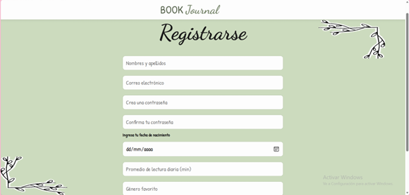
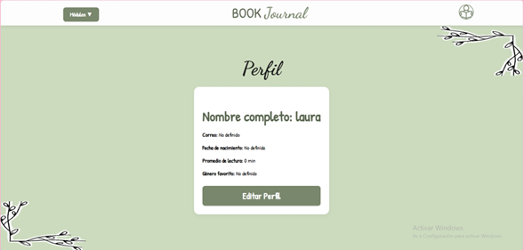
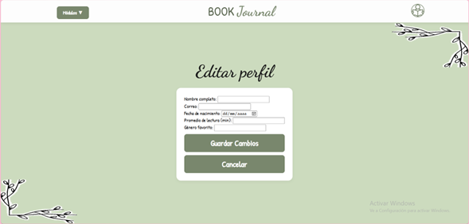
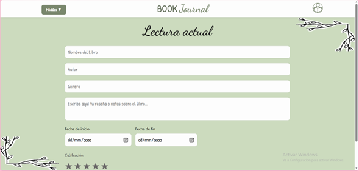
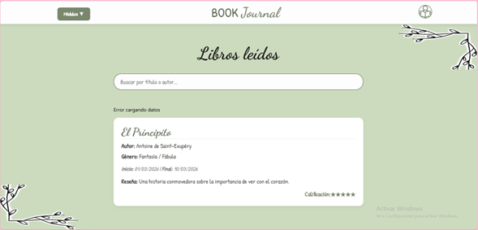
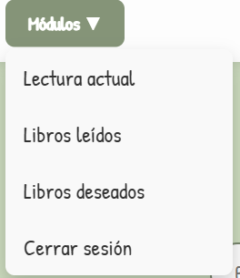
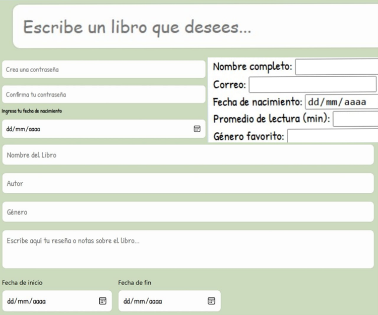

# BookJournal
## Índice
- [Stack Tecnológico](#stack-tecnológico)
- [Identificación, delimitación del problema dominio elegido](#identificación-delimitación-del-problema-dominio-elegido)
- [Propósito de la aplicación](#propósito-de-la-aplicación)
- [Alcance del sistema](#alcance-del-sistema)
- [Funcionalidades principales](#funcionalidades-principales)
- [Actores del sistema](#actores-del-sistema)
- [Procesos clave](#procesos-clave)
- [Distribución de tareas y roles del equipo](#distribución-de-tareas-y-roles-del-equipo)
- [Roles del equipo](#roles-del-equipo)
- [Distribución por fases](#distribución-de-tareas-y-roles-del-equipo)
    - [Planificación](#1-planificación)
    - [Configuración de base de datos](#2-configuración-de-la-base-de-datos)
    - [Desarrollo del backend](#3-desarrollo-del-backend)
    - [Desarrollo del frontend](#4-desarrollo-del-frontend)
    - [Despliegue en la nube](#5-despliegue-en-la-nube)
    - [Documentación](#6-documentación)
- [Estructura del proyecto](#estructura-del-proyecto)
- [Frontend](#frontend)
    - [Descripción](#descripción)
    - [Módulos](#módulos)
    - [Componentes Compartidos](#componentes-compartidos)
    - [Estilos CSS](#estilos-css)
    - [Lógica JavaScript](#lógica-javascript)
    - [Pruebas de integracion](#Pruebas-de-integracion)
- [Base de datos](#base-de-datos)
    - [Arquitectura del sistema](#arquitectura-del-sistema)
    - [Modelo de datosBase de datos](#modelo-de-datos)
    - [Configuración de la base de datos](#configuración-de-la-base-de-datos)
    - [Configuración de seguridad](#configuración-de-seguridad)
    - [Datos de prueba](#datos-de-prueba)
    - [Ejecución completa](#ejecución-completa)
    - [Buenas prácticas implementadas](#buenas-prácticas-implementadas)
  - [Histotrias de usuario](#Historias-de-usuario)
    - [Historia de usuario spring 2](Historia-de-usuario-spring-2)
- [🚀 Despliegue en hósting estático (GCP)](#-despliegue-en-hosting-estático-gcp)
    - [Configuración de variables de entorno ](#️-configuración-de-variables-de-entorno)
    - [Conectividad frontend](#️-conectividad-frontend)
    - [Conectividad Backend y Base de datos](#-conectividad-backend-y-base-de-datos)
    - [Consultas de verificación](#️-consultas-de-verificación)
    - [Buenas prácticas implementadas](#-buenas-prácticas-implementadas)
- [Histotrias de usuario](#historia-de-usuarios-3)
- [📊 Métricas del Proyecto – Sprint 3 (Despliegue en la nube)](#-métricas-del-proyecto--sprint-3-despliegue-en-la-nube)

## Stack Tecnológico
1. Frontend: Maneja la lógica de interacción y estilos interfaz con el cliente.
    - Lenguaje base: HTML5 para la estructura de cada pagina (login.html, registro.html, perfil.html, edit_perfil.html, lista_deseos.html, lectura_actual.html y libros_leidos.html) y css3 para el diseño visual (login.css, registro.css, perfil.css, edit_perfil.css, lista_deseos.css, lectura_actual.css y libros_leidos.css).
    - Tipografía: Integración con Google Font (Dancing Script y Patrick Hand)
    - Lógica de interfaz: JavaScript, se encara de capturar los datos y actualizarlos por medio de clicks y envíos de formularios con datos  (login.js, registro.js, perfil.js, edit_perfil.js, lista_deseos.js, lectura_actual.js y libros_leidos.js)
    - Comunicación: Fetch api, actúa como el mensajero, es quien envía los datos desde los formularios hasta el backend. 

2. Backend: se encarga de procesar la lógica de negocio, gestionar la comunicación con la base de datos y garantizar la seguridad y autenticación de los datos del usuario.
    - Lenguaje: Java 
    - Framework principal: Spring Boot
    - Gestión de dependencias: Maven archivo pom.xml
    - Acceso a datos: Spring data JPA/ Hibernate, permite mapear las clases de java
    - Seguridad: Spring Security para manejo de sesiones.
    - Servidor embebido: Tomcat viene con Spring Boot para correr la aplicación.
    - Control para problemas de versiones: Se creo un Docker el cual permite que cualquier persona pueda ejecutar la aplicación sin problemas de versionamiento.

3. Base de datos: la información capturada por los formularios deja de estar solo en la aplicación y se guarda de forma permanente.
    - Motor de base de datos: PostgreSQL, para gestionar la base de datos relacionadas.
    - Lenguaje de consulta: SQL, creación de tablas, agregar registros nuevos (formularios de ingreso i edición de datos) y consultarlos (búsqueda en libros leídos).
    - Conexión red: La comunicación con el servidor se realiza mediante un túnel de datos dirigido al puerto 5432, garantizando un flujo de información constante y seguro.
    - Creación de instancia: Se configuró una instancia dedicada del motor de base de datos, proporcionando un entorno de ejecución aislado, estable y optimizado para el proyecto.

## Identificación, delimitación del problema dominio elegido
En la actualidad, muchas personas que tienen el hábito de la lectura no cuentan con una herramienta centralizada que les permita organizar, hacer seguimiento y evaluar su progreso lector de manera estructurada. Esto genera dificultades para recordar libros leídos, gestionar listas de lectura futuras y mantener un control sobre el avance personal.

En este contexto, surge la necesidad de desarrollar una solución tecnológica que permita gestionar de forma eficiente la información relacionada con la lectura personal, integrando funcionalidades básicas pero esenciales para el usuario.

El dominio de la aplicación corresponde a la gestión de biblioteca personal, abarcando entidades como usuarios, libros y listas de deseos. Este dominio fue seleccionado por su simplicidad y valor educativo, permitiendo implementar de manera clara patrones CRUD y principios básicos de diseño de software.

## Propósito de la aplicación
Book Journal es una API diseñada para facilitar la gestión de la lectura personal, permitiendo a los usuarios registrar, organizar y consultar información sobre libros leídos, en progreso o pendientes.

El propósito principal es proporcionar una base sólida para el desarrollo de aplicaciones que apoyen el hábito de la lectura mediante el uso de operaciones CRUD y buenas prácticas de desarrollo backend.

## Alcance del sistema
La aplicación se enfoca en un entorno de uso individual, donde cada usuario puede:
- Administrar su propia colección de libros
- Registrar su progreso de lectura
- Gestionar listas de deseos
- Evaluar y calificar libros leídos

El sistema está orientado a fines educativos y de aprendizaje, permitiendo implementar y comprender conceptos fundamentales como persistencia de datos, diseño de APIs y arquitectura backend.

## Funcionalidades principales
- Registro y autenticación de usuarios
- Gestión de libros (crear, consultar, actualizar y eliminar)
- Seguimiento del estado de lectura (pendiente, en progreso, leído)
- Calificación y valoración de libros
- Administración de lista de deseos

## Actores del sistema
- Usuario: Persona que interactúa con la aplicación para gestionar su información de lectura personal.

## Procesos clave
- Registro e inicio de sesión de usuarios
- Gestión del catálogo personal de libros
- Actualización del estado de lectura
- Organización de libros en listas (leídos y por leer)
- Consulta de información registrada

## Distribución de tareas y roles del equipo
Para el desarrollo del proyecto Book Journal, se definió una distribución de responsabilidades basada en roles específicos, permitiendo una ejecución organizada y eficiente en cada fase del desarrollo.

### Roles del equipo
- Líder de proyecto / Backend / Despliegue backend (Cloud Run)<br>
**Juan José Narváez Ortiz**<br>
Responsable de la planificación general, coordinación del equipo, desarrollo del backend y despliegue del servicio en la nube mediante Cloud Run.

- Frontend Developer<br>
**Laura Daniela López Santos**<br>
Encargada del desarrollo de la interfaz de usuario, consumo de la API y manejo de la interacción del sistema.

- Gestión de Base de Datos (Cloud SQL)<br>
**María Paula Riveros**<br>
Responsable de la creación, configuración y despliegue de la base de datos en Google Cloud SQL, así como la gestión de accesos y estructura de datos.

- Despliegue de Frontend (Cloud Storage)<br>
**Dayana Michelle Pulido**<br>
Encargada del despliegue del frontend utilizando servicios de almacenamiento en la nube, garantizando su disponibilidad y acceso.

## Distribución por fases
### 1. Planificación
Responsable: Juan José Narváez Ortiz
- Definir dominio de la aplicación
- Asignar responsabilidades

Responsable: María Paula Riveros
- Diseñar modelo de datos
- Crear diagrama entidad-relación

### 2. Configuración de base de datos
Responsable: María Paula Riveros
- Crear instancia PostgreSQL en Cloud SQL
- Configurar acceso y seguridad
- Crear base de datos y tablas
- Poblar con datos de prueba

### 3. Desarrollo del backend
Responsable: Juan José Narváez Ortiz
- Configurar proyecto Spring Boot
- Implementar modelos de datos
- Crear endpoints REST
- Configurar CORS
- Probar endpoints

### 4. Desarrollo del frontend
Responsable: Laura Daniela López Santos
- Crear estructura del proyecto
- Desarrollar formularios y vistas
- Manejar estados de carga y errores
- Realizar pruebas de integración

Responsable: Juan José Narváez Ortiz
- Implementar consumo de API

Tareas:
- Desplegar servicios
- Configurar variables de entorno
- Verificar conectividad

### 5. Despliegue en la nube
- Base de datos (Cloud SQL): María Paula Riveros
- Backend (Cloud Run): Juan José Narváez Ortiz
- Frontend (Cloud Storage): Dayana Michelle Pulido

### 6. Documentación
Responsables: Todos los integrantes
- Crear README completo
- Documentar API
- Incluir capturas
- Registrar video demostrativo

## Estructura del proyecto
```
    Book-Journal/
    ├── frontend/                   // Interfaz de usuario y lógica de cliente
    │   ├── html/                   // Vistas de la aplicación
    │   │   ├── login.html          // Acceso al sistema
    │   │   ├── registro.html       // Creación de nuevas cuentas
    │   │   ├── perfil.html         // Datos del usuario y configuración
    │   │   ├── lista_deseos.html   // Libros pendientes por leer
    │   │   ├── lectura_actual.html // Seguimiento del libro en curso
    │   │   ├── libros_leidos.html  // Historial y calificación (estrellas)
    │   │   └── home.html           // Pantalla principal / Dashboard
    │   ├── css/                    // Estilos visuales consolidados
    │   │   ├── estilos.css         // Archivo unificado de estilos
    │   │   └── componentes.css     // Estilos de cards, botones y estrellas
    │   ├── java-script/            // Lógica de interacción y consumo de API
    │   │   ├── login.js            // Validación y envío de credenciales
    │   │   ├── registro.js         // Lógica de creación de usuarios
    │   │   ├── historial.js        // Manejo de la lista de libros y estrellas
    │   │   └── api-config.js       // Configuración de Fetch y endpoints
    │   └── recursos/               // Activos estáticos y multimedia
    │       ├── Imagen1.png         // Decoraciones de libros
    │       ├── Imagen2.png         // Decoraciones laterales del diario
    │       └── icon-perfil.png     // Avatar por defecto del usuario
    ├── Book-Journal/
    ├── backend/                   // Código fuente en Java (Spring Boot)
    │   ├── src/main/java/com/bookjournal/
    │   │   ├── controllers/       // Endpoints REST (@RestController)
    │   │   ├── models/            // Entidades de base de datos (@Entity)
    │   │   ├── repositories/      // Interfaces para consultas SQL (JPA)
    │   │   ├── services/          // Lógica de negocio avanzada
    │   │   └── security/          // Configuración de filtros y JWT
    │   ├── src/main/resources/
    │   │   └── application.properties // Configuración de conexión a PostgreSQL
    │   └── pom.xml                // Dependencias de Maven
    ├── database/                   // Persistencia de datos (PostgreSQL)
    │   ├── scripts/                // Scripts de creación de tablas y datos iniciales
    │   │   ├── create_tables.sql   // Definición de tablas de usuarios y libros
    │   │   └── seed_data.sql       // Datos de prueba para el desarrollo
    │   └── diagramas/              // Modelo Entidad-Relación (MER)
    └── README.md                   // Documentación técnica completa del proyecto
```

## Explicación estructura del Proyecto
Se crearon 7 archivos HTML:
- edit_perfil.html  
- lectura_actual.html  
- libros_leidos.html  
- lista_deseos.html  
- login.html  
- registro.html  
- perfil.html  

Cada HTML cuenta con su archivo CSS correspondiente, para mantener una estructura organizada y facilita la modificación de estilos de cada HTML sin generar conflicto con los demas.

También se creó un archivo JavaScript por cada módulo, encargado de:
- La interacción entre módulos
- El funcionamiento de botones
- El envío y recepción de datos con la API
- El manejo de errores (conexión, validaciones y eliminación de datos)

# Frontend
## Descripción

El frontend de BOOK JOURNAL está estructurado en módulos independientes pero interconectados. Cada módulo contiene su propio archivo HTML, CSS y JavaScript, esto permite facilitar el mantenimiento del código y mejorar la escalabilidad de la pagina.

La pagina permite gestionar usuarios, registrar libros, visualizar historial de lectura y administrar listas de deseos de futuas lecturas.

- html: contiene la estructura visual de cada página.
- css: define los estilos visuales.
- java-script: contiene la lógica de interacción y conexión con la API.
- recursos: almacena imágenes y elementos gráficos.

## Módulos

### Login
formulario para el ingreso a las pagina de Book Journal se solicita que se ingrese el correo o usuario y la contraseña además de dos botones el que da inicio de sesión y otro que dirige a la página de registro. Además, tiene una imagen de unos libros.


```html
<form id="loginForm">
    <input type="text" id="correo" placeholder="Correo">
    <input type="password" id="password" placeholder="Contraseña">

    <button type="submit">Iniciar sesión</button>

    <button type="button" onclick="window.location.href='registro.html'">
        Registrarse
    </button>
</form>
```

- se define un formulario que será capturado por JavaScript mediante su id.
- se muestran los campos donde el usuario ingresa el correo y la contraseña, en el caso de la contraseña los caracteres estan ocultos
- boton que activa el evento submit del formulario.
- no envía el formulario, solo ejecuta una acción en caso que las credenciales sean correctas y se dirige a la pagina principal lectura_actual.html

### Registro
formulario diseñado para capturar los datos de un nuevo usuario (nombre completo, correo electrónico, crear una contraseña, fecha de nacimiento, promedio de lectura diaria y genero favorito), tiene dos botones Finalizar registro para que se guarden los datos del formulario en la base de datos y volver para regresar a login.




```html
<form id="registroForm">
    <input id="nombre">
    <input id="correo">
    <input id="password">
    <input id="confirmar">

    <button>Registrar</button>
</form>
```

- Captura los datos necesarios para crear un usuario.
- El botón ejecuta el evento submit que será interceptado por JavaScript.
- No hay validaciones en HTML, todas se hacen en JavaScript.

### Perfil



```html
<div id="perfil">
    <p id="nombre"></p>
    <p id="correo"></p>
</div>
```

- los datos se muestran encontenedor principal y se utiliza `<p>` para mostrar datos dinámicos.


## Editar Peril
Formulario sencillo para el ingreso de nuevos libros a la lista de deseos, una vez ingresados los libros que se desea ver en el futuro cada libro aparecerá en una tarjeta y se permite seleccionar cuando ya se hallando leído.



```html
<form id="form-editar-perfil" class="datos-perfil" autocomplete="off">
            <div class="campo">
                <label for="nombre">Nombre completo:</label>
                <input type="text" id="nombre" name="nombre" required>
            </div>
            <div class="campo">
                <label for="correo">Correo:</label>
                <input type="email" id="correo" name="correo" required>
            </div>
            <div class="campo">
                <label for="fechaNacimiento">Fecha de nacimiento:</label>
                <input type="date" id="fechaNacimiento" name="fechaNacimiento" required>
            </div>
            <div class="campo">
                <label for="promedioLectura">Promedio de lectura (min):</label>
                <input type="number" id="promedioLectura" name="promedioLectura" required>
            </div>
            <div class="campo">
                <label for="generoFavorito">Género favorito:</label>
                <input type="text" id="generoFavorito" name="generoFavorito" required>
            </div>
            <div class="botones-acciones">
                <button type="submit" class="btn-editar">Guardar Cambios</button>
                <button type="button" onclick="irperfil()" class="btn-cancelar">Cancelar</button>
            </div>
        </form>
```

## Lista Deseos
formulario donde se ingresa los datos sobre un libro que se está leyendo en el momento (Nombre del libro, autor, genero, reseña, fecha inicio y fecha final, calificación mediante 5 estrellas interactivas). al final del formulario tiene un botón el cual permite guardar los datos del formulario y se dirige al módulo de libros leídos.


```html
        <div class="container">
            <h1 class="titulo-libros-deseados">Lista de libros deseados</h1>
            <div class="lista-libros-deseados" id="lista-deseados">
                <div class="input-section">
                    <input type="text" id="wish-input" placeholder="Escribe un libro que desees...">
                    <button onclick="addWish()">Agregar</button>
                </div>
                <div id="lista-deseos-container"></div>
            </div>
        </div>
```

## Lectura Actual
 en este módulo se pueden visualizar los libros que ya se han agregado desde el módulo lectura actual, cada libro aparece en una tarjeta diferente y se puede borrar en caso de que haya un error o solo se quiera borrar del registro, este módulo cuenta con una barra de búsqueda, en la cual se podrá buscar dentro de la base de datos.



```html
<div class="form-content">
                <input type="text" id="titulo" placeholder="Nombre del Libro" required>
                <input type="text" id="autor" placeholder="Autor" required>
                <input type="text" id="genero" placeholder="Género">
                <textarea id="resena" placeholder="Escribe aquí tu reseña o notas sobre el libro..."></textarea>
                <div class="fechas">
                    <div class="date-group">
                        <label for="inicio">Fecha de inicio</label>
                        <input type="date" id="inicio">
                    </div>
                    <div class="date-group">
                        <label for="final">Fecha de fin</label>
                        <input type="date" id="final">
                    </div>
                </div>
                <div class="rating-container">
                    <label>Calificación:</label>
                    <div class="stars" id="star-rating">
                        <span class="star" data-value="1">★</span>
                        <span class="star" data-value="2">★</span>
                        <span class="star" data-value="3">★</span>
                        <span class="star" data-value="4">★</span>
                        <span class="star" data-value="5">★</span>
                    </div>
                    <input type="hidden" id="calificacion" value="0">
                </div>
                <button type="button" class="boton_terminar_lectura" onclick="Guardar_libro()">
                    Finalizar lectura
                </button>
            </div>
```

## Libros Leidos

Para cada uno de los módulos se creó un css personalizado a pesar de que muchas de las funciones son muy parecidas hay algunas funciones diferentes en cada módulo, a nivel general los css tiene dos fuentes (Patrick hand y dancing script), da tonalidades verdes y pone imágenes decorativas de hojas. en el caso de lectura actual y libros leídos también maneja las interacciones de colores de las estrellas, también permite visualizar mejor las fechas.



```html
<div style="margin-bottom:20px;">
                <input type="text" id="busqueda" placeholder="Buscar libro..." 
                       style="padding:10px; width:70%;">
                <button onclick="buscarLibros()" style="padding:10px;">
                    Buscar
                </button>
            </div>
            <div class="historia-containerS" id="historial-libros">
                <!-- Aquí se renderizan los libros -->
            </div>
```

### Componentes Compartidos
### Navbar 
una vez dentro de la página de Book Journal hay partes que se comparten en todos los módulos. En la parte superior se encuentra una barra, en la parte izquierda se encuentra un menú desplegable en el cual se puede navegar en toda la página (lectura actual, libros leídos, libros deseados y cerrar sesión) en la mitad se encuentra el nombre de la página BOOK JOURNAL y en la parte derecha esta una imagen que funciona como un botón el cual llevara al módulo de perfil.




```html
<header>
    <h1>BOOK JOURNAL</h1>

    <nav>
        <a href="lectura_actual.html">Lectura actual</a>
        <a href="libros_leidos.html">Libros leídos</a>
        <a href="lista_deseos.html">Deseados</a>
        <a onclick="cerrarSesion()">Cerrar sesión</a>
    </nav>

    
</header>
```

- `<header>` contenedor principal de navegación.
- `<nav>` agrupa los enlaces.
- `<a href="">` navegación entre páginas.
- `onclick` ejecuta funciones JavaScript directamente.
- `` funciona como botón de acceso al perfil.


## Estilos CSS
En los archivos CSS hay partes que estan repetidas como body el cual controla el color de fondo de toda la pagina los tipos de letras, el color de los botones etc.

### Estilo base del documento

```css
body {
    font-family: 'Patrick Hand', cursive;
    background-color: #e6f2e6;
    margin: 0;
    padding: 0;
}
```

- Define la tipografía principal de toda la aplicación usando una fuente tipo manuscrita.
- Aplica un color de fondo verde claro para mantener la estética del diario.
- Elimina los márgenes y espacios por defecto del navegador para evitar inconsistencias visuales.

## Tipografia 
```
    font-family: 'Patrick Hand', cursive;
    font-family: 'Dancing Script', cursive;
```
 

- define el tipo de letra que va a tener la pafina.

### Botones


```css
button {
    background-color: green;
    color: white;
    border: none;
    padding: 10px 15px;
    border-radius: 8px;
    cursor: pointer;
}
```

- Define el color principal del botón (verde).
- Establece el color del texto en blanco para contraste.
- Elimina los bordes por defecto del navegador.
- Agrega espacio interno para mejorar la apariencia y el tamaño del botón.
- Redondea las esquinas para un diseño más moderno.
- Cambia el cursor a tipo "pointer" para indicar que es interactivo.


### Interacción de botones (hover)

```css
button:hover {
    background-color: darkgreen;
}
```

- Cambia el color del botón cuando el usuario pasa el cursor encima.
- Proporciona retroalimentación visual de interacción.
- Mejora la experiencia del usuario al indicar que el botón es clickeable.


### Inputs y áreas de texto



```css
input, textarea {
    padding: 10px;
    border-radius: 5px;
    border: 1px solid #ccc;
    width: 100%;
    margin-bottom: 10px;
}
```

- Aplica espacio interno para mejorar la legibilidad del texto ingresado.
- Redondea los bordes para mantener coherencia con el diseño general.
- Añade un borde gris claro para delimitar los campos.
- Hace que los inputs ocupen todo el ancho disponible.
- Agrega separación entre campos para evitar que se vean pegados.


### Cards de libros


```css
.card {
    background-color: white;
    border-radius: 10px;
    padding: 15px;
    box-shadow: 0 2px 5px rgba(0,0,0,0.1);
}
```

- Define un fondo blanco para separar visualmente las tarjetas del fondo general.
- Redondea los bordes para mantener el estilo del sistema.
- Añade espacio interno para organizar el contenido.
- Aplica una sombra ligera para dar sensación de profundidad.

## Sistema de Estrellas


## Perfil e Imágenes Laterales


### Barra de navegación (Navbar)

```css
header {
    display: flex;
    justify-content: space-between;
    align-items: center;
    background-color: #2e7d32;
    color: white;
    padding: 10px;
}
```
- Usa `flexbox` para organizar los elementos en una fila horizontal.
- Distribuye los elementos (logo, menú, perfil) con espacio entre ellos.
- Centra verticalmente todos los elementos.
- Aplica un color verde oscuro como fondo principal de navegación.
- Define el color del texto en blanco para contraste.
- Añade espacio interno para mejorar la apariencia.


### Enlaces de navegación

```css
nav a {
    margin: 0 10px;
    color: white;
    text-decoration: none;
}
```
- Agrega espacio horizontal entre los enlaces del menú.
- Mantiene el color blanco para coherencia con la navbar.
- Elimina el subrayado por defecto de los enlaces.


### Interacción en enlaces

```css
nav a:hover {
    text-decoration: underline;
}
```
- Añade un subrayado cuando el usuario pasa el cursor.
- Indica visualmente que el enlace es interactivo.
- Mejora la accesibilidad y experiencia de navegación.


## Lógica JavaScript
En esta parte se podra encontrar la forma logica en la que funciona toda la pagina web, como la navegacion entre modulos, como funcionan los botones, etc.

### Login.js

```javascript
document.getElementById("loginForm").addEventListener("submit", async (e) => {
```

- Selecciona el formulario.
- Escucha el evento submit.
- `async` permite usar `await`.


```javascript
e.preventDefault();
```
Evita que el formulario recargue la página.


```javascript
const correo = document.getElementById("correo").value;
const password = document.getElementById("password").value;
```
Obtiene los valores ingresados por el usuario.


```javascript
if (!correo || !password) {
    alert("Completa todos los campos");
    return;
}
```
Valida que los campos no estén vacíos.


```javascript
const respuesta = await fetch(`${API_URL}/login`, {
```
Realiza una petición HTTP al backend.


```javascript
method: 'POST',
headers: { 'Content-Type': 'application/json' },
body: JSON.stringify({ correo, password })
```

- POST: envía datos.
- headers: indica formato JSON.
- body: convierte el objeto a JSON.


```javascript
if (!respuesta.ok) {
    alert("Credenciales incorrectas");
    return;
}
```

Valida si la respuesta HTTP fue exitosa.


```javascript
const usuario = await respuesta.json();
```
Convierte la respuesta en un objeto JavaScript.


```javascript
localStorage.setItem("usuarioLogueado", JSON.stringify(usuario));
```
Guarda la sesión en el navegador.


```javascript
window.location.href = "lectura_actual.html";
```
Redirige al usuario.


```javascript
} catch (error) {
    console.error(error);
    alert("Error de conexión");
}
```
Captura errores de red o del servidor.

## Integracion de API para encontrar las portadas de los libros
Se añadió una mejora donde se implemento un API de libros lo que permite que la poner el titulo de un libro leído este mostrará su portada correspondiente desde esta API es externa y pertenece a Open Library, es un proyecto del Internet Archive, una biblioteca digital enorme que guarda información de millones de libros, como el titulo autor y la portada del libro


```javascript
async function obtenerPortada(titulo) {
    try {
        const res = await fetch(`https://openlibrary.org/search.json?q=${encodeURIComponent(titulo)}`);
        const data = await res.json();

        const libro = data.docs?.[0];

        if (!libro || !libro.cover_i) {
            return 'https://via.placeholder.com/120x180?text=Sin+portada';
        }

        return `https://covers.openlibrary.org/b/id/${libro.cover_i}-M.jpg`;

    } catch (error) {
        console.error("Error obteniendo portada:", error);
        return 'https://via.placeholder.com/120x180?text=Error';
    }
}
```

## Pruebas de integracion
En esta sección se describen las pruebas de integración realizadas para validar la interacción entre los componentes de la interfaz de usuario y la lógica de negocio en el entorno de desarrollo. Estas pruebas aseguran que los elementos del DOM respondan correctamente a los datos y acciones esperadas.
### Configuracion del entorno para las pruebas
Para estas pruebas se utilizó Jest como motor de ejecución, integrando el entorno de simulación jsdom. Esta configuración permite emular un navegador web dentro de Node.js, facilitando la manipulación de elementos HTML sin necesidad de abrir un navegador real. La declaración utilizada al inicio de los archivos de prueba es:
```javascript
/** 
 * @jest-environment jsdom
 */
describe('Pruebas de Integración - Book Journal', () => {
    test('Debe verificar que el campo de título recibe texto correctamente', () => {

        //campo de texto falso en la memoria
        document.body.innerHTML = '<input type="text" id="titulo" value="Cien años de soledad">';
        
        // se busca el campo usando el codigo
        const inputTitulo = document.getElementById('titulo');
        
        // verificar valor
        expect(inputTitulo.value).toBe('Cien años de soledad');
    });
});
```
### Detalle de las Pruebas Realizadas
Las pruebas se agrupan bajo el bloque Pruebas de Integración - Book Journal, enfocándose inicialmente en la validación de formularios y la captura de datos de entrada.

### Validación de Entrada de Datos:
Se verificó que el flujo de captura de información en los formularios de la aplicación funcione de manera íntegra. El proceso seguido en las pruebas ejecutadas es el siguiente:

- Simulación del DOM: Se inyecta código HTML directamente en el cuerpo del documento simulado (document.body.innerHTML) para representar un campo de entrada de texto con un identificador específico.

- Selección de Elementos: Se utiliza el método de selección por ID para localizar el componente dentro de la memoria del entorno de prueba, simulando la forma en que el código de producción interactúa con la página.

- Verificación de Estado: Se establece una expectativa (assertion) para comprobar que el valor contenido en el campo de texto coincida exactamente con la información ingresada, asegurando que no existan distorsiones en la manipulación de los datos.

### Procedimiento para la Ejecución de Pruebas
Para ejecutar este conjunto de pruebas y verificar la estabilidad de la interfaz, se deben seguir estos pasos detallados:

- Instalación de Dependencias: Es necesario contar con Jest instalado en el proyecto. En caso de no tenerlo, se puede añadir mediante el comando npm install --save-dev jest jest-environment-jsdom.
- Preparación del Script: Se debe asegurar que el archivo package.json contenga la configuración de prueba apuntando a Jest para facilitar su lanzamiento desde la terminal.
- Lanzamiento de los Tests: Se ejecuta el comando npm test en la consola. El sistema buscará automáticamente los archivos con extensión .test.js o .spec.js, procesará la directiva de @jest-environment jsdom y entregará un reporte detallado sobre el éxito de la validación del campo de título y otros componentes evaluados.

### Resultado de las pruebas 


#  Base de datos

---

##  Arquitectura del sistema

El sistema está diseñado bajo una arquitectura por capas:

* **Capa de presentación:** Interfaces como Login, Registro, Inicio, Libros, Deseos y Perfil
* **Capa de negocio:** Controladores y servicios que gestionan la lógica del sistema
* **Seguridad:** Implementación basada en autenticación (JWT)
* **Capa de persistencia:** Repositorios usando JPA / Hibernate
* **Base de datos:** Almacenamiento en PostgreSQL

 Archivo incluido:
[Ver diagrama de arquitectura](diagrama_arquitectura_book_journal.html)

---

##  Modelo de datos

El modelo de datos está basado en un esquema relacional en PostgreSQL.

###  Entidades principales

* **usuarios**

  * id (PK)
  * nombre
  * apellido
  * email (único)
  * contrasena
  * fecha_registro
  * fecha_nacimiento
  * genero_favorito
  * promedio_lectura

* **libros_leidos**

  * id (PK)
  * usuario_id (FK)
  * titulo
  * autor
  * genero
  * fecha_lectura
  * calificacion (1–5)
  * resena
  * inicio
  * fin

* **libros_deseados**

  * id (PK)
  * usuario_id (FK)
  * titulo
  * autor
  * genero
  * prioridad (1–3)
  * notas

### Relaciones

* Un **usuario** puede tener muchos **libros leídos**
* Un **usuario** puede tener muchos **libros deseados**

 Archivo sugerido:
[Ver diagrama de arquitectura](database/DiagramaE.html)

---

## Configuración de la base de datos

### 1. Crear base de datos

```sql
CREATE DATABASE bookjournal_db;
```

---

### 2. Ejecutar scripts

```bash
psql -U postgres -d bookjournal_db -f database/database.sql
psql -U postgres -d bookjournal_db -f database/security.sql
```

---

##  Configuración de seguridad

Se implementan medidas básicas de seguridad en PostgreSQL para proteger el acceso a la base de datos.

###  Creación de usuario

```sql
CREATE USER bookjournal_app WITH PASSWORD 'CHANGE_ME';
```

---

###  Restricción de accesos

```sql
REVOKE ALL ON SCHEMA public FROM PUBLIC;
REVOKE ALL ON ALL TABLES IN SCHEMA public FROM PUBLIC;
```

---

###  Permisos controlados

```sql
GRANT CONNECT ON DATABASE bookjournal_db TO bookjournal_app;
GRANT USAGE ON SCHEMA public TO bookjournal_app;

GRANT SELECT, INSERT, UPDATE, DELETE
ON ALL TABLES IN SCHEMA public
TO bookjournal_app;
```

---

###  Autenticación

Editar el archivo `pg_hba.conf`:

```
host all all 127.0.0.1/32 md5
```

Luego reiniciar el servicio de PostgreSQL.

---

##  Datos de prueba

El proyecto incluye datos iniciales para pruebas:

* Usuarios registrados
* Libros leídos con calificaciones
* Libros deseados con prioridades

 Archivo:
[Ver diagrama de arquitectura](database/database.sql)

---

##  Ejecución completa

1. Crear base de datos
2. Ejecutar `database.sql`
3. Ejecutar `security.sql`
4. Configurar seguridad
5. Reiniciar PostgreSQL

---

##  Buenas prácticas implementadas

* Uso de usuario de aplicación (no `postgres`)
* Restricción de permisos por defecto
* Control de acceso a tablas
* Uso de contraseñas hasheadas
* Separación de capas en la arquitectura

# Histotrias de usuario
## Historia de usuario spring 2
### 1. Registro y Visualización de Libros en el book journal
Como usuario lector, quiero mediante un formulario agregar el libro que estoy leyendo en el momento a mi biblioteca personal para así poder visualizar mi progreso de lectura de una forma bien organizada, y quiero poder ver la portada del libro. 

#### Criterios de Aceptación
El sistema debe permitirnos la entrada de texto para buscar títulos a traves de una API externa. Cuando seleccionemos "Finalizar lectura", los datos deberan ser enviados mediante una petición POST al backend. Inmediatamente despues, la vista principal se actualizara sin necesidad de recargar la pagina completa, y permitira agregar un nuevo libro. 

#### Historia de usuario 1: Procedimiento de Desarrollo Paso a Paso
1. Diseño del Componente de Búsqueda:
Se diseño un formulario donde se penso en un input de texto y un botón para enviar. Se implementó una validacion para no se puedan guardar campos vacios.
2. Consumo de la API:
Se creó una función que consulta la API para buscar los libros y traer la información. También se manejó el estado de carga y los posibles errores para avisarle al usuari
3. Renderizado Dinámico de Datos:
Con la información recibida por parte del primer formulario de lectura actual, se usó JavaScript para recorrer los datos y crear tarjetas en la pagina de libros leidos mas adelante. 
4. Finalizar ingreso 
Al presionar "Finalizar lectura", una peticion POST se envió a la base de datos PostgreSQL. Si todo salio bien, se sumó el libro al estado local, actualizando la vista al instante.
### Historia de usuario 2: Gestión de Reseñas y Calificación por Estrellas
Como lector, quiero calificar y reseñar los libros que he terminado mediante un formulario interactivo para mantener un registro crítico de mis lecturas.

#### Criterios de Aceptación:
En la interfaz de lectura actual se presenta una herramienta para la calificacion de 1 a 5 estrellas, ademas hay un espacio donde como usuario lector va a poder dejar una reseña para el libro que acaba de leer. La visualizacion final va a incluir la calificacion con las estrellas dinamicas y el texto previamente guardado en el campo de reseña.

#### Procedimiento de Desarrollo Paso a Paso:
1. Construcción del Formulario de Feedback: 
Se crea una sección dentro del formulario del libro que contenga el control de estrellas de una forma dinamica y un campo para agregar informacion. 
2. Vinculación con el Backend: 
Se establece una conexión con el controlador de Spring Boot encargado de las reseñas. El formulario debe recopilar el ID del usuario, el ID del libro, el valor numérico de la calificación y el string de la reseña.
3. Envío de Datos y Manejo de Respuestas: 
Se realiza una petición de tipo PUT o POST (dependiendo de si se está creando o editando) hacia la API. El sistema devuelva el objeto actualizado para confirmar que la información se procesó correctamente en el servidor.
4. Refresco de la Visualización: 
Tras la confirmación, la interfaz debe transformar el formulario en un bloque de texto estático que muestre la reseña guardada en la pagina libros leidos y las estrellas bloqueadas en la posición seleccionada, mejorando la experiencia de visualización de datos del usuario.

### Historia de usuario 3
Depuración de la Biblioteca mediante la Eliminación de Registros
Como usuario de la aplicación, deseé tener la posibilidad de remover títulos de mi lista de libros leídos para mantener mi colección actualizada y corregir inclusiones accidentales.

#### Criterios de Aceptación:
La interfaz presenta un icono de papelera que es facil de identificar en cada tarjeta de libros leidos. El sistema lanza un mensaje de confirmación antes de ejecutar el borrado definitivo para prevenir la pérdida accidental de información, al confirmar la acción, el libro se elimina de la base de datos PostgreSQL y la tarjeta desaparece de la vista actual de forma dinámica.

#### Procedimiento de Desarrollo Paso a Paso Realizado:
1. Implementación del Control de Borrado: 
Se añadió un elemento interactivo botón con icono de papelera en el componente de visualización de cada libro. Se programó un escuchador de eventos para capturar el identificador único del registro correspondiente al libro seleccionado.
2. Gestión de la Interacción de Seguridad:
Se desarrolló un cuadro de diálogo o modal de confirmación. Este paso aseguró que la acción fuera intencional, mejorando la usabilidad de la interfaz al prevenir errores de manipulación por parte del usuario.
3. Ejecución de la Petición a la API: 
Una vez confirmada la acción, se disparó una función asíncrona que realizó una petición HTTP bajo el método DELETE hacia el endpoint específico del backend en Spring Boot. La URL de la petición incluyó el ID del recurso para asegurar que solo se afectara al libro deseado.
4. Sincronización de la Vista y el Estado:
 Tras recibir una respuesta exitosa del servidor (código 200 o 204), se procedió a filtrar el arreglo de libros en el estado del frontend. Esta manipulación del DOM permitió que la tarjeta del libro se desvaneciera o fuera removida de la cuadrícula de forma inmediata, garantizando una visualización de datos coherente con el estado actual del servidor.

### 🚀 Despliegue en hosting estático (GCP)
Para el desarrollo del despliegue del frontend previamente creado, se escogió como hosting estático GCP (Google Cloud Platform), haciendo uso del servicio de Cloud Storage (Buckets).
**Guía de despliegue**

1. **Creación del Bucket**
      En el apartado de Cloud Storage se realiza la creación del bucket.
      
      
      

2. **Carga de Archivos**
      Se llenan los datos necesarios para la creación del bucket y luego se anexan los archivos correspondientes que componen todo el frontend.
      

3. **Configuración de página principal y página de error**

       Se configura login.html como página principal del frontend y se establece la página de error correspondiente.
      

4. **Configuración de servicios Públicos**
      Un paso importante es otorgar los permisos necesarios para que usuarios externos puedan ver los estilos y la conectividad entre los componentes. Se selecciona el bucket y se dirige al apartado de Permisos.
      
      
      En el menú de ➕ Agregar principal:
      
      Nueva entidad: allUsers
      Rol: Visualizador de objetos Storage

      Se guardan los cambios y el frontend queda accesible al público sin necesidad de permisos adicionales.
      
      

5. **Verificación de Despliegue**
Con la configuración de login.html como página principal, se accede a la URL pública generada por el bucket y se verifica que la página carga correctamente con todos sus estilos, sin necesidad de permisos.
      
      **🔗Url de frontend**
      [https://storage.googleapis.com/frontendapi/frontend/html/login.html](Frontend)
      
      

### ⚙️ Configuración de Variables de Entorno

Se realizó la configuración de las variables de entorno necesarias para garantizar la correcta conexión entre el servicio backend desplegado en Cloud Run y la base de datos PostgreSQL alojada en Cloud SQL.
Configuración en application.properties
El archivo de configuración del backend se parametrizó para que los valores sean leídos dinámicamente desde variables de entorno, manteniendo valores por defecto para el entorno local:

```
spring.datasource.url=${SPRING_DATASOURCE_URL:jdbc:postgresql://localhost:5432/book_journal}
spring.datasource.username=${SPRING_DATASOURCE_USERNAME:postgres}
spring.datasource.password=${SPRING_DATASOURCE_PASSWORD:postgres}

spring.jpa.hibernate.ddl-auto=${SPRING_JPA_HIBERNATE_DDL_AUTO:update}
spring.jpa.properties.hibernate.dialect=${SPRING_JPA_PROPERTIES_HIBERNATE_DIALECT:org.hibernate.dialect.PostgreSQLDialect}
spring.jpa.show-sql=${SPRING_JPA_SHOW_SQL:true}
```

Esto permite que la aplicación utilice una configuración distinta según el entorno de ejecución (desarrollo local o producción en la 
nube), sin necesidad de modificar el código fuente.

**Variables de definidad en CloudRun**

Durante el despliegue en Google Cloud Run, se definieron las siguientes variables de entorno:

```
SPRING_DATASOURCE_URL=jdbc:postgresql://localhost/bookjournal?socketFactory=com.google.cloud.sql.postgres.SocketFactory&cloudSqlInstance=bookjournal-493603:southamerica-east1:bookjournal2

SPRING_DATASOURCE_USERNAME=bookjournal2

SPRING_DATASOURCE_PASSWORD=********

```
**Descripción de variables**
| Variable | Descripción |
|----------|-------------|
| `SPRING_DATASOURCE_URL` | Ruta de conexión JDBC hacia PostgreSQL usando `SocketFactory` para comunicación segura con Cloud SQL |
| `SPRING_DATASOURCE_USERNAME` | Usuario utilizado por el backend para autenticarse en la base de datos |
| `SPRING_DATASOURCE_PASSWORD` | Contraseña asociada al usuario de la base de datos |

**Resultado**
Con esta configuración se aseguró la conectividad entre:
- ✅ Backend → Cloud Run
- ✅ Base de datos → Cloud SQL (PostgreSQL)
- ✅ Entorno de despliegue → Producción en GCP

### 🖥️ Conectividad Frontend
Se realizó un video de demostración para evidenciar la conectividad entre los componentes que conforman el frontend del proyecto. Se muestran los siguientes flujos:

Registro de usuario
Inicio de sesión
Registro de género favorito
Horas diarias de lectura
Libros leídos
Puntuación de libros leídos
Libros deseados
Edición de perfil

🎬 [Ver video de demostración – Conectividad Frontend](https://fundacionlibertadores-my.sharepoint.com/:v:/g/personal/dmpulidom01_libertadores_edu_co/IQB5j6D9DAlZSrtQy-X3pBihAWW840B8AMuP0HwIRQjJhbo?nav=eyJyZWZlcnJhbEluZm8iOnsicmVmZXJyYWxBcHAiOiJPbmVEcml2ZUZvckJ1c2luZXNzIiwicmVmZXJyYWxBcHBQbGF0Zm9ybSI6IldlYiIsInJlZmVycmFsTW9kZSI6InZpZXciLCJyZWZlcnJhbFZpZXciOiJNeUZpbGVzTGlua0NvcHkifX0&e=dk7bMd)

### 🔗 Conectividad Backend y Base de Datos
Se realizó un video donde se muestra:

Las variables de entorno establecidas para el backend y declaradas en GCP
La instancia de la base de datos con sus respectivos puertos y credenciales de ingreso
La URL del backend
La imagen de Docker en la que fue montado el servicio

Todo esto con el fin de demostrar la funcionalidad entre los componentes del backend.
🎬 [Ver video de demostración – Conectividad Backend y BD](https://fundacionlibertadores-my.sharepoint.com/:v:/g/personal/dmpulidom01_libertadores_edu_co/IQBQTER911pATpmkj9c-vy4iAdqB6mtQWqKX_vGL81n3PD4?e=rhNcxO&nav=eyJyZWZlcnJhbEluZm8iOnsicmVmZXJyYWxBcHAiOiJTdHJlYW1XZWJBcHAiLCJyZWZlcnJhbFZpZXciOiJTaGFyZURpYWxvZy1MaW5rIiwicmVmZXJyYWxBcHBQbGF0Zm9ybSI6IldlYiIsInJlZmVycmFsTW9kZSI6InZpZXcifX0%3D)

### 🗄️ Consultas de Verificación
Para la demostración práctica de la base de datos, se ejecutaron diversas consultas que evidencian el correcto funcionamiento del sistema y la persistencia en tiempo real de los usuarios registrados desde el frontend.
**Mostrar todos los usuarios**
`SELECT * FROM usuario;`
**Mostrar solo los campos importantes de los usuarios**
`SELECT id, nombre, correo
FROM usuario;`
**Contar cuántos usuarios hay**
`SELECT COUNT(*) AS total_usuarios
FROM usuario;`
**Mostrar todos los libros**
`SELECT * FROM libros;`
**Contar libros**
`SELECT * FROM libros;`
**Mostrar deseos**
`SELECT * FROM deseo;`
**Mostrar últimos registros**
`SELECT *
FROM usuario
ORDER BY id DESC
LIMIT 5;`
**Mostrar estructura de una tabla**
`SELECT column_name, data_type
FROM information_schema.columns
WHERE table_name = 'usuario';`

### ✅ Buenas Prácticas Implementadas

# Desplegar frontend en servicio de hosting estático (#31)

Para el despliegue del frontend se implementaron diversas buenas prácticas que 
garantizan la disponibilidad, seguridad y accesibilidad de la aplicación. En primer 
lugar, se optó por un **hosting estático en Google Cloud Storage**, lo cual es una 
práctica recomendada para aplicaciones frontend que no requieren procesamiento en el 
servidor, reduciendo costos y mejorando el rendimiento. 

Se configuró una **página principal y una página de error personalizada**, asegurando 
que el usuario siempre tenga una respuesta visual adecuada independientemente de la 
ruta a la que intente acceder. En cuanto a los permisos, se aplicó el principio de 
**mínimo privilegio necesario**, otorgando únicamente el rol de *Visualizador de 
objetos Storage* al principal `allUsers`, lo que permite el acceso público de solo 
lectura sin exponer capacidades de escritura o administración del bucket. Finalmente, 
se verificó el correcto despliegue accediendo a la URL pública generada, confirmando 
que los estilos, componentes y navegación funcionan correctamente en el entorno de 
producción.

---

# Configuración de variables de entorno (#32)

En la configuración del entorno de producción se siguieron prácticas fundamentales de 
seguridad y portabilidad. La más destacada fue la **externalización de credenciales 
mediante variables de entorno**, evitando que datos sensibles como la URL de conexión, 
el usuario y la contraseña de la base de datos quedaran expuestos en el código fuente 
o en el repositorio. Esto sigue el principio de la metodología **12-Factor App**, que 
establece que la configuración debe estar separada del código.

Se implementaron **valores por defecto en `application.properties`**, permitiendo que 
el equipo pueda ejecutar la aplicación en entorno local sin necesidad de configurar 
variables adicionales, mientras que en producción los valores son sobreescritos 
automáticamente por las variables definidas en **Cloud Run**. Adicionalmente, la 
conexión a **Cloud SQL** se realizó a través de `SocketFactory`, garantizando una 
comunicación segura y autenticada entre el backend y la base de datos, sin exponer 
puertos directamente a internet.

---

# Verificar conectividad entre componentes (#33)

Para la verificación del sistema en producción se adoptaron prácticas de **validación 
end-to-end**, comprobando que cada capa de la arquitectura (frontend, backend y base 
de datos) se comunica correctamente entre sí. Se realizaron pruebas funcionales 
cubriendo los flujos críticos del sistema: registro de usuario, inicio de sesión, 
gestión de géneros favoritos, registro de libros leídos, puntuación, lista de deseos 
y edición de perfil.

Complementariamente, se ejecutaron **consultas SQL de verificación directamente sobre 
la base de datos en producción**, confirmando que los registros creados desde el 
frontend se persistían en tiempo real. Esta práctica permite detectar inconsistencias 
entre la interfaz y la capa de datos de forma temprana. Todo el proceso fue 
documentado mediante **videos de demostración**, lo cual constituye una buena práctica 
de evidencia y trazabilidad del trabajo realizado, facilitando auditorías y revisiones 
posteriores del proyecto.

### Historia de usuarios-3

# Desplegar frontend en servicio de hosting estático

## Como equipo de desarrollo
Quiero desplegar la aplicación frontend en un servicio de hosting
Para garantizar su accesibilidad desde cualquier navegador

## Criterios de Aceptación:
- [x] El bucket está creado y configurado correctamente en Cloud Storage
- [x] Los archivos HTML, CSS y JS del frontend están cargados en el bucket
- [x] `login.html` está configurada como página principal y existe una página de error
- [x] El permiso `allUsers` con rol **Visualizador de objetos Storage** está habilitado
- [x] La URL pública carga el frontend con todos sus estilos sin necesidad de permisos

## Estimación: 1
## Sprint: Sprint 3 – Despliegue en la nube
## Responsable: @Bygyacqq
## Prioridad: P2
## Tamaño: S
## Label: enhancement

## Verificar conectividad entre componentes

## Como equipo de QA y desarrollo
Quiero validar que frontend, backend y base de datos se comuniquen correctamente
Para confirmar que el entorno desplegado funciona de extremo a extremo

## Criterios de Aceptación:
- [x] El frontend carga correctamente desde la URL pública del bucket
- [x] El registro de usuario persiste en la base de datos en tiempo real
- [x] El inicio de sesión autentica correctamente contra el backend
- [x] Las funcionalidades de género favorito, libros leídos, puntuación, libros deseados y edición de perfil operan sin errores
- [x] Las consultas SQL sobre `usuario`, `libros` y `deseo` retornan datos consistentes

## Estimación: 1
## Sprint: Sprint 3 – Despliegue en la nube
## Responsable: @Bygyacqq
## Prioridad: P2
## Tamaño: XS
## Label: enhancement

# 📊 Métricas del Proyecto – Sprint 3 (Despliegue en la nube)

## Velocity (Velocidad del equipo)
Mide los puntos de historia completados en el sprint.

| Historia de Usuario | Estimación | Completado |
|---|---|---|
| #31 – Desplegar frontend en hosting estático | 1 | 1 |
| #33 – Verificar conectividad entre componentes | 1 | 1 |
| **TOTAL** | **2** | **2** |

**Velocity del sprint: 2 puntos → El equipo completó el 100% del trabajo comprometido.**

---

## Burndown
Trabajo restante vs. tiempo durante el sprint.

| Día | Trabajo Ideal Restante (pts) | Trabajo Real Restante (pts) |
|---|---|---|
| Abril 21 (inicio) | 2 | 2 |
| Abril 21 (cierre) | 0 | 0 |

Ambos issues fueron iniciados y cerrados el mismo día (21 de abril de 2026), completando el sprint en su totalidad en una jornada de trabajo.

---

## Lead Time (Tiempo de entrega)
Tiempo desde que la tarea fue creada hasta que fue marcada como Done.

> **Fórmula:** Lead Time = Fecha de cierre − Fecha de creación

| Issue | Creación | Cierre | Lead Time |
|---|---|---|---|
| #31 – Desplegar frontend | Abril 21 | Abril 21 | 1 día |
| #33 – Verificar conectividad | Abril 21 | Abril 21 | 1 día |

**Lead Time promedio: 1 día**

---

## Cycle Time (Tiempo de ciclo)
Tiempo desde que el equipo inició activamente la tarea (In Progress) hasta que fue completada (Done).

> **Fórmula:** Cycle Time = Fecha Done − Fecha In Progress

| Issue | In Progress | Done | Cycle Time |
|---|---|---|---|
| #31 – Desplegar frontend | Abril 21 | Abril 21 | < 1 día |
| #33 – Verificar conectividad | Abril 21 | Abril 21 | < 1 día |

**Cycle Time promedio: menos de 1 día**

> Lead Time y Cycle Time son iguales, lo que indica que las tareas fueron tomadas y ejecutadas el mismo día sin tiempo de espera en cola.

---

## Throughput (Rendimiento)
Cantidad de tareas completadas en el periodo del sprint.

> **Fórmula:** Throughput = Tareas completadas / Días del sprint

| Indicador | Valor |
|---|---|
| Tareas completadas | 2 issues |
| Duración del sprint | 1 día (Abril 21) |
| Throughput diario | 2 tareas/día |
| Puntos entregados | 2 puntos |

---

## Resumen general

| Métrica | Valor obtenido |
|---|---|
| Velocity | 2 puntos (100% completado) |
| Burndown | Sprint cerrado en 0 puntos restantes el mismo día |
| Lead Time promedio | 1 día |
| Cycle Time promedio | < 1 día |
| Throughput | 2 tareas / 1 día |
### Reportes Visuales — GitHub Insights

Se utilizó **GitHub Insights** para el seguimiento visual de las métricas del proyecto.

###  Commits over time
Actividad semanal del 11 al 18 de abril de 2026. Se observa un incremento 
significativo en la segunda semana (~45 commits vs ~20 commits).


###  Top Committers
Distribución de commits por contribuidor. El committer principal concentra 
aproximadamente 65 commits, seguido por contribuidores secundarios.


