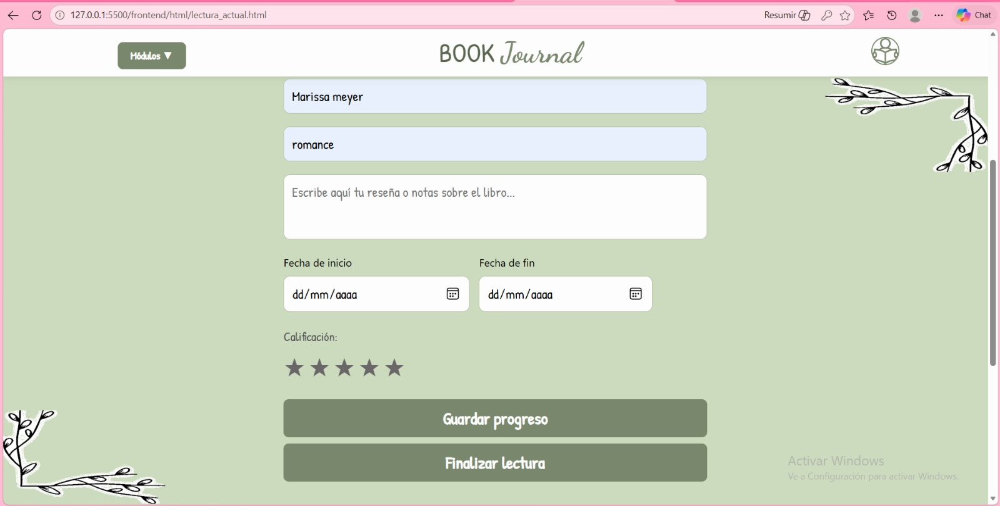
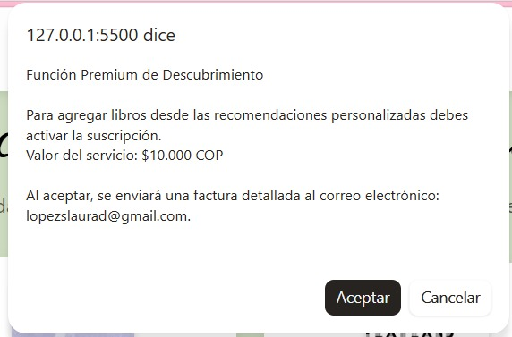
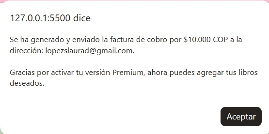
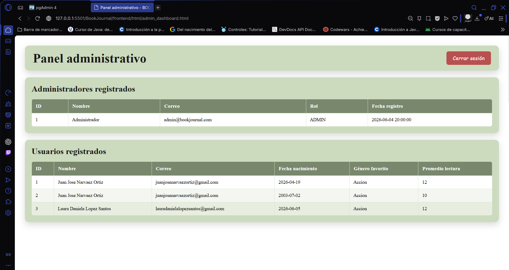

## Nuevas Funcionalidades de Descubrimiento y Gestión de Lectura

El ecosistema de la aplicación ha sido expandido de forma significativa mediante el desarrollo e integración de un avanzado módulo de descubrimiento literario, diseñado con el propósito de optimizar la administración y el flujo de adquisición de nuevas lecturas por parte de los usuarios en la plataforma. La interfaz gráfica principal de este módulo se encuentra estructurada en el archivo `descubrir_libros.html`, la cual establece un entorno visual adaptativo que incluye una barra de navegación con menús desplegables para la conmutación entre los distintos apartados del sistema, tales como el registro de lectura actual, el histórico de libros leídos y la lista de deseos. El núcleo operativo de este componente reside en el archivo de procesamiento asíncrono `descubrir_libros.js`, el cual se activa inmediatamente tras desencadenarse el evento de carga del documento en el navegador (`DOMContentLoaded`). En esta primera fase, el script realiza una llamada al almacenamiento local del navegador (`localStorage`) para extraer los datos de sesión almacenados bajo la clave de identificación del usuario, procediendo a realizar múltiples peticiones simultáneas hacia los servicios del backend para recuperar el género literario favorito, la lista de deseos consolidada mediante solicitudes HTTP GET al endpoint remoto de deseos (`/api/deseos`) y el registro histórico de obras leídos a través del endpoint de libros leídos (`/api/libros/leidos`).

Una vez recopilada esta información inicial, el sistema ejecuta un algoritmo de procesamiento de lenguaje natural en el cliente que genera una bolsa de palabras clave basada en las preferencias del usuario, filtrando conectores gramaticales y seleccionando términos representativos con una longitud superior a cuatro caracteres extraídos directamente de los títulos guardados y leídos. En caso de que el perfil del usuario no cuente con registros previos, el sistema aplica un arreglo de términos de respaldo predefinidos que incluye categorías universales como ficción, clásicos, fantasía, romance e historia. Con la palabra clave seleccionada aleatoriamente de esta bolsa de términos, la aplicación realiza una petición asíncrona por medio del protocolo HTTP Fetch hacia la API pública externa de Open Library, limitando los resultados a quince registros para su posterior depuración. El script procesa la respuesta en formato JSON, oculta los indicadores de carga visual y procede a realizar un filtrado estricto para excluir aquellos títulos que el lector ya posee guardados en su base de datos o que ya ha completado con anterioridad. Finalmente, los primeros seis libros que superan este filtro son renderizados dinámicamente en el contenedor web mediante la creación de tarjetas estructuradas que despliegan de forma detallada la imagen de la portada obtenida de los servidores de Open Library, el título oficial de la obra, el nombre del autor principal y un botón interactivo configurado para agregar el título seleccionado directamente a la biblioteca personal.


---

## Módulo de Lectura en Curso y Actualización de Progreso

La administración de las lecturas en curso se encuentra centralizada en la interfaz provista por el archivo `lectura_actual.html`, la cual interactúa directamente con la lógica de negocio implementada en el archivo JavaScript `lectura_actual.js`. Esta sección proporciona al usuario un formulario técnico detallado que recopila metadatos esenciales sobre la obra en ejecución, incluyendo campos de entrada de texto estructurado para el nombre del libro, el autor y el género literario, así como un área de texto extendida (`textarea`) destinada a la redacción libre de reseñas, comentarios analíticos o notas de seguimiento. Adicionalmente, la interfaz incorpora controles de selección de fechas para delimitar con exactitud el día de inicio y de finalización de la lectura, complementado con un componente interactivo de calificación basado en un sistema de cinco estrellas fijadas en etiquetas HTML (`span`) que alteran dinámicamente sus propiedades de estilo visual y color mediante eventos de posicionamiento del cursor y clics del usuario. Un aspecto técnico destacado de este formulario es su capacidad de respuesta inmediata ante la introducción del título del libro; al detectar variaciones en el campo de texto a través de un oyente de eventos de entrada (`input`), el script ejecuta una consulta asíncrona en tiempo real a los servicios de Open Library para recuperar el identificador único de la carátula y renderizar una vista previa automatizada de la portada en las dimensiones establecidas por la hoja de estilos.

El flujo de persistencia dentro de este módulo ofrece dos alternativas operativas según el estado de avance del lector. Por un lado, cuando el usuario interactúa con el botón de finalización de lectura (`Guardar_libro`), la aplicación compila un objeto estructurado con la totalidad de los campos del formulario y realiza una petición HTTP POST hacia el endpoint principal del servicio web (`/api/libros`), redirigiendo al usuario hacia la sección de libros leídos una vez que la API confirma el almacenamiento exitoso en el repositorio de datos centralizado. Por otro lado, si el usuario decide guardar únicamente su avance parcial por medio del botón `Guardar_progreso`, se ejecuta la función destinada a la preservación temporal, la cual encapsula la información vigente junto con la ruta de la portada y procede a instanciar de forma dinámica una tarjeta de progreso (`libro-card`) en la zona inferior de la pantalla. Este componente renderiza el título, autor, género, fechas, la reseña redactada y la calificación visualizada en un ciclo de estrellas coloreadas, guardando simultáneamente el estado en el `localStorage` bajo la clave `lecturaActual`. La tarjeta incluye un botón de edición que, al ser activado, invoca una función de recuperación que repuebla detalladamente cada campo del formulario inicial, despliega las estrellas correspondientes a la calificación previa y realiza un desplazamiento suave de la pantalla (`window.scrollTo`) hacia el inicio de la página para facilitar modificaciones inmediatas por parte del usuario.





---

## Servicio de Suscripción Premium

La plataforma de gestión de lectura incorpora un modelo de control de acceso e interacciones avanzadas implementado en el script de descubrimiento, el cual regula la comunicación entre el carrusel de recomendaciones personalizadas y el almacenamiento permanente de la biblioteca del usuario. Específicamente, cuando un usuario interactúa con el botón para agregar un libro sugerido desde la sección de descubrimiento hacia su lista de deseos personal, el sistema no ejecuta el guardado de forma directa, sino que inicia un proceso detallado de verificación de privilegios en el cliente a través de la función `agregarDesdeRecomendados`. El script extrae la identidad del usuario activo desde el almacenamiento local, verifica que exista una sesión iniciada y construye una clave de verificación específica utilizando el identificador único del perfil concatenado con el prefijo premium. Acto ligado, se realiza una consulta al estado del almacenamiento local para comprobar si el atributo de usuario Premium se encuentra habilitado en el entorno; en caso de confirmarse la existencia de dicho registro con valor afirmativo, la aplicación elude las restricciones y procede directamente a invocar la función asíncrona de guardado, transmitiendo un paquete JSON con el título del libro hacia el servicio web encargado de la gestión de deseos mediante una petición HTTP POST hacia el endpoint remoto `/api/deseos`.

En el escenario donde el usuario no cuente con los privilegios avanzados activos en su sesión, el sistema interrumpe el flujo ordinario y procede a ejecutar la apertura de una pasarela de pago simulada mediante componentes de diálogo nativos del navegador (`confirm` y `alert`) a través de la función `abrirPasarelaPagoSimulada`. La aplicación genera inicialmente un mensaje estructurado de notificación donde se detalla minuciosamente que la función de descubrimiento y traspaso automatizado es exclusiva para miembros suscritos, especificando el valor exacto del servicio fijado en diez mil pesos colombianos ($10.000 COP) y advirtiendo de manera clara que la aceptación de este proceso conllevará la emisión de una factura formal de cobro que vincula directamente el correo electrónico del usuario registrado. Si el usuario rechaza los términos expuestos en la ventana de confirmación, el sistema emite una alerta indicando la cancelación del proceso de suscripción y detiene por completo la transferencia del libro. No obstante, si el usuario confirma su aceptación, el sistema despliega de inmediato una segunda ventana de notificación informando que la factura detallada ha sido generada y remitida con éxito a la dirección de correo electrónico institucional asociada al perfil, actualizando el estado del usuario en el `localStorage` bajo la clave Premium correspondiente con valor verdadero y reanudando de manera automatizada el proceso de guardado que había quedado en suspenso, logrando la inserción del título literario y actualizando visualmente la lista de deseos en la interfaz gráfica del sistema.





---

## Resumen Técnico y Arquitectura de Archivos Vinculados

El correcto funcionamiento y ciclo de mantenimiento del sistema descrito se fundamenta en una separación estricta de responsabilidades entre los diferentes componentes del cliente. El archivo `descubrir_libros.html` es el encargado de estructurar el entorno visual del módulo de recomendaciones de la plataforma, proporcionando el contenedor HTML específico (`#contenedor-recomendados`) donde se inyectan las tarjetas de los libros sugeridos y configurando los enlaces del menú desplegable que conectan al lector con los demás módulos. Por su parte, la lógica de negocio asociada recae sobre `descubrir_libros.js`, el cual analiza el perfil del usuario logueado, procesa las palabras clave basadas en sus hábitos históricos y realiza la comunicación asíncrona con la API externa de Open Library, gobernando además el flujo de validación Premium y la activación de la pasarela de pago simulada.

La captura y el seguimiento de las obras en curso se dividen de manera análoga entre el archivo de marcado y el de comportamiento lógico. El archivo `lectura_actual.html` define la maquetación del formulario técnico, disponiendo los campos de texto para metadatos, el área de anotaciones críticas, las entradas de fechas para el control del ciclo de lectura y el sistema visual de calificación por estrellas. Esta interfaz es controlada por `lectura_actual.js`, el cual intercepta los eventos de entrada de texto para buscar y renderizar automáticamente las portadas desde la API de Open Library, administrando paralelamente las funciones de persistencia temporal en el almacenamiento local del cliente (`localStorage`) y la sincronización definitiva de datos mediante peticiones HTTP POST hacia la API centralizada del proyecto.

Finalmente, la sección dedicada a las aspiraciones literarias del usuario se gestiona mediante los componentes de la lista de deseos. El archivo `lista_deseos.html` delimita el espacio gráfico para la administración de la biblioteca deseada, incorporando campos de entrada para la inserción manual de nuevos títulos y las zonas dinámicas requeridas para mostrar las tarjetas añadidas de forma automatizada. La persistencia y manipulación de este listado son operadas por `lista_deseos.js`, el cual implementa las operaciones de lectura, creación y borrado (CRUD) a través de solicitudes asíncronas con el método Fetch hacia el endpoint `/api/deseos`, procesando la obtención de portadas individuales y permitiendo la eliminación física de registros mediante el envío estructurado de peticiones HTTP DELETE hacia los servicios del backend.


## Implementacion de Prometheus y Grafana
Con el objetivo de supervisar el rendimiento y estado operativo de la aplicación **Book Journal**, se implementó una solución de monitoreo basada en **Prometheus** y **Grafana**.

Esta integración permite recopilar, almacenar y visualizar métricas en tiempo real relacionadas con:

- **Uso de CPU** — porcentaje de procesamiento consumido por la JVM.
- **Consumo de memoria JVM** — uso del heap y non-heap de la máquina virtual Java.
- **Número de solicitudes HTTP** — volumen de peticiones recibidas por la API.
- **Tiempo de respuesta de la API** — latencia promedio de los endpoints.
- **Estado de la aplicación** — disponibilidad del servicio (activo / inactivo).
- **Conexiones a PostgreSQL** — estado del pool de conexiones administrado por HikariCP.

> **¿Por qué monitorear?**  
> Sin observabilidad, los problemas de rendimiento o disponibilidad pueden pasar desapercibidos hasta que afectan a los usuarios finales. Con este stack de monitoreo es posible detectar anomalías antes de que se conviertan en fallos críticos.

---

## Arquitectura de la Solución

El flujo de datos entre los componentes es el siguiente:

```
┌─────────────────┐
│     Grafana     │  ← Visualización de métricas en dashboards interactivos
└────────┬────────┘
         │  Consultas PromQL
         ▼
┌─────────────────┐
│   Prometheus    │  ← Recolección y almacenamiento temporal de métricas
└────────┬────────┘
         │  HTTP scrape cada 15s
         ▼
┌─────────────────┐
│  Spring Boot    │  ← Backend de la aplicación
│  + Actuator     │  ← Expone el endpoint /actuator/prometheus
│  + Micrometer   │  ← Instrumenta y genera las métricas
└────────┬────────┘
         │
         ▼
┌─────────────────┐
│   PostgreSQL    │  ← Base de datos (métricas de HikariCP)
└─────────────────┘
```

### Explicación del flujo

| Paso | Descripción |
|------|-------------|
| 1 | Spring Boot con Micrometer genera métricas de la JVM, Tomcat, HikariCP y los endpoints HTTP. |
| 2 | Spring Actuator expone esas métricas en el endpoint `/actuator/prometheus`. |
| 3 | Prometheus hace un *scrape* (solicitud HTTP) a ese endpoint cada 15 segundos y almacena los datos. |
| 4 | Grafana consulta a Prometheus mediante el lenguaje **PromQL** y renderiza los dashboards. |

---

## Tecnologías Utilizadas

| Tecnología | Versión recomendada | Función principal |
|---|---|---|
| **Spring Boot** | 3.x | Backend de la aplicación |
| **Spring Actuator** | (incluida en Spring Boot) | Exposición de endpoints de monitoreo |
| **Micrometer** | (incluida en Spring Boot) | Instrumentación y generación de métricas |
| **Prometheus** | `prom/prometheus` latest | Recolección y almacenamiento de métricas |
| **Grafana** | `grafana/grafana` latest | Visualización y alertas |
| **Docker / Docker Compose** | 24.x+ | Contenedorización de servicios |
| **HikariCP** | (incluida en Spring Boot) | Pool de conexiones a PostgreSQL |

---

## Implementación de Prometheus

### 1. Dependencias Maven

Se deben agregar dos dependencias al archivo `pom.xml` del proyecto.

**Spring Boot Actuator** — habilita los endpoints de gestión y monitoreo:

```xml
<dependency>
    <groupId>org.springframework.boot</groupId>
    <artifactId>spring-boot-starter-actuator</artifactId>
</dependency>
```

**Micrometer Registry Prometheus** — transforma las métricas al formato que Prometheus puede leer:

```xml
<dependency>
    <groupId>io.micrometer</groupId>
    <artifactId>micrometer-registry-prometheus</artifactId>
</dependency>
```

> **Nota:** No es necesario especificar versión, ya que Spring Boot gestiona la compatibilidad a través del BOM (*Bill of Materials*).

---

### 2. Configuración de Actuator

En el archivo `src/main/resources/application.properties`, se habilitan los endpoints necesarios:

```properties
# Exponer los endpoints: health, info y prometheus
management.endpoints.web.exposure.include=health,info,prometheus

# Mostrar detalles completos del estado de la aplicación
management.endpoint.health.show-details=always

# Habilitar la exportación de métricas al formato Prometheus
management.prometheus.metrics.export.enabled=true
```

**Descripción de cada propiedad:**

| Propiedad | Descripción |
|---|---|
| `exposure.include=health,info,prometheus` | Activa solo los endpoints necesarios (buena práctica de seguridad). |
| `health.show-details=always` | Muestra el estado de cada componente (DB, disco, etc.) en el endpoint `/actuator/health`. |
| `metrics.export.enabled=true` | Habilita la generación del endpoint `/actuator/prometheus`. |

---

### 3. Endpoint de Métricas

Una vez iniciada la aplicación, Spring Boot expone automáticamente el endpoint:

```
http://localhost:8080/actuator/prometheus
```

Este endpoint devuelve todas las métricas en **formato de texto plano** compatible con Prometheus. Las métricas provienen de diferentes subsistemas:

| Subsistema | Ejemplos de métricas |
|---|---|
| **JVM** | `jvm_memory_used_bytes`, `jvm_gc_pause_seconds` |
| **CPU** | `process_cpu_usage`, `system_cpu_usage` |
| **HTTP / Tomcat** | `http_server_requests_seconds_count`, `tomcat_threads_current` |
| **HikariCP** | `hikaricp_connections_active`, `hikaricp_connections_idle` |
| **Sistema operativo** | `process_uptime_seconds`, `system_load_average_1m` |

**Ejemplo de salida del endpoint:**

```
# HELP process_cpu_usage The "recent cpu usage" for the Java Virtual Machine process
# TYPE process_cpu_usage gauge
process_cpu_usage 0.012345

# HELP jvm_memory_used_bytes The amount of used memory
# TYPE jvm_memory_used_bytes gauge
jvm_memory_used_bytes{area="heap",id="G1 Eden Space",} 1.234567E7

# HELP http_server_requests_seconds  
# TYPE http_server_requests_seconds summary
http_server_requests_seconds_count{method="GET",status="200",uri="/api/books",} 42.0
```

---

### 4. Archivo de Configuración de Prometheus

Se debe crear el archivo `prometheus/prometheus.yml` en la raíz del proyecto:

```yaml
global:
  scrape_interval: 15s      # Frecuencia con la que Prometheus solicita métricas
  evaluation_interval: 15s  # Frecuencia de evaluación de reglas de alertas

scrape_configs:
  - job_name: 'spring-book'               # Nombre identificador del job
    metrics_path: '/actuator/prometheus'  # Ruta del endpoint de métricas
    static_configs:
      - targets: ['backend:8080']         # Host y puerto del backend (nombre del servicio Docker)
```

**Parámetros clave:**

| Parámetro | Valor | Descripción |
|---|---|---|
| `scrape_interval` | `15s` | Prometheus consultará las métricas cada 15 segundos. |
| `job_name` | `spring-book` | Etiqueta que identifica esta fuente en las consultas PromQL. |
| `metrics_path` | `/actuator/prometheus` | Ruta específica donde Spring expone las métricas. |
| `targets` | `backend:8080` | Dirección del servicio backend dentro de la red Docker. |

> **Importante:** El valor `backend` en `targets` corresponde al nombre del servicio definido en `docker-compose.yml`. Dentro de una red Docker, los servicios se resuelven por nombre.

---

### 5. Contenedor Docker de Prometheus

Se agrega el siguiente servicio al archivo `docker-compose.yml`:

```yaml
prometheus:
  image: prom/prometheus
  container_name: prometheus-book
  ports:
    - "9090:9090"         # Puerto de acceso a la UI de Prometheus
  volumes:
    - ./prometheus/prometheus.yml:/etc/prometheus/prometheus.yml  # Configuración personalizada
  depends_on:
    - backend             # Se inicia después del backend
  networks:
    - app-network
```

Una vez iniciado, la interfaz web de Prometheus estará disponible en:

```
http://localhost:9090
```

Desde allí se pueden ejecutar consultas PromQL directamente y verificar el estado de los *scrapes*.

---

## Implementación de Grafana

### 1. Contenedor Docker de Grafana

Se agrega el siguiente servicio al archivo `docker-compose.yml`:

```yaml
grafana:
  image: grafana/grafana
  container_name: grafana-book
  ports:
    - "3000:3000"          # Puerto de acceso a la UI de Grafana
  environment:
    - GF_SECURITY_ADMIN_USER=admin
    - GF_SECURITY_ADMIN_PASSWORD=admin
  depends_on:
    - prometheus           # Se inicia después de Prometheus
  networks:
    - app-network
```

---

### 2. Acceso y Credenciales

Grafana estará disponible en:

```
http://localhost:3000
```

| Campo | Valor |
|---|---|
| **Usuario** | `admin` |
| **Contraseña** | `admin` |

> **Recomendación de seguridad:** Cambiar la contraseña por defecto inmediatamente después del primer inicio de sesión, especialmente en entornos productivos.

---

### 3. Configuración del Data Source

Para conectar Grafana con Prometheus y poder visualizar las métricas:

1. Ir a **Connections → Data Sources → Add data source**.
2. Seleccionar **Prometheus**.
3. Configurar la URL:

```
http://localhost:9090
```

4. Hacer clic en **Save & Test** para verificar la conexión.

> El nombre `prometheus` en la URL corresponde al nombre del servicio Docker definido en `docker-compose.yml`, resuelto automáticamente dentro de la red interna.

---

## Métricas Implementadas

A continuación se describen las métricas configuradas en los paneles del dashboard.

### CPU

Visualiza el porcentaje de CPU consumido por el proceso Java en tiempo real.

```promql
process_cpu_usage
```

- **Tipo:** `gauge` (valor instantáneo entre 0 y 1)
- **Uso:** Detectar picos de procesamiento o procesos fuera de control.

---

### Memoria JVM

Monitorea el uso de memoria de la máquina virtual Java, diferenciando heap y non-heap.

```promql
jvm_memory_used_bytes
```

- **Tipo:** `gauge`
- **Etiquetas:** `area` (heap / nonheap), `id` (G1 Eden Space, Metaspace, etc.)
- **Uso:** Identificar fugas de memoria o sobredimensionamiento del heap.

---

### Solicitudes HTTP por Segundo

Mide la tasa de solicitudes recibidas por la API en el último minuto.

```promql
sum(rate(http_server_requests_seconds_count[1m]))
```

- **Función `rate()`:** Calcula la tasa de cambio por segundo de un contador en el intervalo indicado.
- **Función `sum()`:** Agrega todas las rutas y métodos HTTP para obtener el total.
- **Uso:** Evaluar la carga de trabajo actual y detectar tráfico inusual.

---

### Tiempo Promedio de Respuesta

Calcula el tiempo promedio que tarda la API en responder cada solicitud.

```promql
sum(rate(http_server_requests_seconds_sum[1m]))
/
sum(rate(http_server_requests_seconds_count[1m]))
```

- **Numerador:** Tiempo total acumulado de todas las solicitudes.
- **Denominador:** Número total de solicitudes.
- **Resultado:** Latencia promedio en segundos.
- **Uso:** Detectar degradación del rendimiento o endpoints lentos.

---

### Estado de la Aplicación

Indica si el servicio está disponible o no.

```promql
up
```

| Valor | Significado |
|---|---|
| `1` | El servicio está activo y respondiendo correctamente. |
| `0` | El servicio está caído o inaccesible. |

- **Uso:** Configurar alertas para recibir notificaciones cuando el servicio se caiga.

---

### Conexiones PostgreSQL (HikariCP)

Monitorea el pool de conexiones a la base de datos administrado por HikariCP.

```promql
hikaricp_connections
```

Métricas derivadas útiles:

| Métrica | Descripción |
|---|---|
| `hikaricp_connections_active` | Conexiones en uso actualmente. |
| `hikaricp_connections_idle` | Conexiones disponibles en el pool. |
| `hikaricp_connections_pending` | Solicitudes esperando una conexión libre. |
| `hikaricp_connections_max` | Máximo de conexiones configuradas. |

- **Uso:** Detectar agotamiento del pool o problemas de conexión a la base de datos.

---

## Dashboard Implementado

El dashboard de Grafana incluye los siguientes paneles:

| Panel | Métrica | Tipo de visualización |
|---|---|---|
| Solicitudes HTTP por segundo | `rate(http_server_requests_seconds_count[1m])` | Gráfica de líneas |
| Tiempo promedio de respuesta | `rate(sum) / rate(count)` | Gráfica de líneas |
| Uso de CPU | `process_cpu_usage` | Gauge / Gráfica |
| Consumo de memoria JVM | `jvm_memory_used_bytes` | Gráfica de área |
| Estado del pool PostgreSQL | `hikaricp_connections` | Gráfica de barras |
| Endpoints con mayor latencia | `http_server_requests_seconds` por `uri` | Tabla |

> Los dashboards pueden exportarse e importarse en formato JSON desde **Dashboard → Share → Export**, lo que facilita replicar la configuración en otros entornos.

---

## Beneficios Obtenidos

La integración de Prometheus y Grafana proporciona las siguientes ventajas al sistema Book Journal:

| Beneficio | Descripción |
|---|---|
| **Monitoreo en tiempo real** | Visualización continua del estado del sistema sin necesidad de logs manuales. |
| **Detección temprana de fallos** | Las alertas permiten actuar antes de que los usuarios se vean afectados. |
| **Identificación de cuellos de botella** | Análisis de endpoints lentos y recursos saturados. |
| **Análisis histórico** | Prometheus almacena métricas a lo largo del tiempo para identificar tendencias. |
| **Supervisión de recursos** | Control de CPU, memoria y conexiones en un único lugar. |
| **Observabilidad completa** | Visibilidad de la JVM, la API y la base de datos de forma unificada. |

---

La implementación de **Prometheus** y **Grafana** incorporó capacidades de observabilidad al sistema Book Journal, facilitando el seguimiento del rendimiento de la aplicación Spring Boot y la base de datos PostgreSQL.

Mediante la recopilación automática de métricas a través de Micrometer y Actuator, la construcción de dashboards interactivos en Grafana y el almacenamiento histórico en Prometheus, es posible:

- Analizar el comportamiento del sistema en tiempo real.
- Detectar y anticipar problemas de rendimiento.
- Garantizar una operación más estable y eficiente de la plataforma.

Este stack de monitoreo representa una base sólida sobre la que se pueden construir estrategias de alertas avanzadas, análisis de capacidad y optimización continua del sistema.

## Implementacion de roles en la pagina web
**Guía: Interfaz de administración y login**

Resumen
- **Qué contiene:** documentación de la creación de la interfaz administrativa (páginas HTML, CSS, JS) y los cambios necesarios en el backend para el correcto funcionamiento de un administrador.
- **Alcance:** login administrativo, panel (dashboard) que lista administradores y usuarios, cabeceras requeridas y recomendaciones de seguridad.

Archivos clave modificados
- **Backend:**
  - [/BookJournal/backend/src/main/java/com/example/back_end/controller/AdminController.java](/BookJournal/backend/src/main/java/com/example/back_end/controller/AdminController.java) : controlador REST para administración. Endpoints: `POST /api/admins/login`, `POST /api/admins/registro`, `GET /api/admins`, `GET /api/admins/usuarios`. Implementa verificación sencilla usando la cabecera `X-Admin-Id` para autorizar.
  - [/BookJournal/backend/src/main/java/com/example/back_end/config/SecurityConfig.java](/BookJournal/backend/src/main/java/com/example/back_end/config/SecurityConfig.java) : configuración de seguridad de Spring. Actualmente desactiva CSRF y permite todas las peticiones (configuración mínima para desarrollo).

- **Frontend (HTML/CSS/JS):**
  - [/BookJournal/frontend/html/admin_login.html](/BookJournal/frontend/html/admin_login.html) : formulario de login para administradores.
  - [/BookJournal/frontend/html/admin_dashboard.html](/BookJournal/frontend/html/admin_dashboard.html) : panel administrador que muestra tablas de administradores y usuarios.
  - [/BookJournal/frontend/css/admin_login.css](/BookJournal/frontend/css/admin_login.css) : estilos del login y partes compartidas con el dashboard.
  - [/BookJournal/frontend/css/admin_dashboard.css](/BookJournal/frontend/css/admin_dashboard.css) : estilos específicos del dashboard.
  - [/BookJournal/frontend/javascript/admin_login.js](/BookJournal/frontend/javascript/admin_login.js) : lógica de login; hace `POST` a `/api/admins/login`, guarda `administradorLogueado` en `localStorage` y redirige al dashboard.
  - [/BookJournal/frontend/javascript/admin_dashboard.js](/BookJournal/frontend/javascript/admin_dashboard.js) : lógica del dashboard; lee `administradorLogueado` desde `localStorage`, añade `X-Admin-Id` en los headers y solicita `GET /api/admins` y `GET /api/admins/usuarios`.


## Pagina funcional





Flujo funcional
- Login:
  1. Usuario abre `admin_login.html`, ingresa `correo` y `password`.
  2. `admin_login.js` hace `POST` a `.../api/admins/login` con body `{ correo, password }`.
  3. Si la respuesta es 200 OK, el objeto admin recibido se guarda en `localStorage` bajo la clave `administradorLogueado` y se redirige a `admin_dashboard.html`.

- Dashboard:
  1. Al cargar `admin_dashboard.html`, `admin_dashboard.js` lee `administradorLogueado` y si no existe o no tiene `id` redirige a `admin_login.html`.
  2. Si existe, prepara headers con `X-Admin-Id: <admin.id>` y realiza dos peticiones paralelas:
     - `GET /api/admins` -> lista administradores
     - `GET /api/admins/usuarios` -> lista usuarios
  3. Los datos devueltos se pintan en tablas (`admins-table` y `usuarios-table`).

Detalles del backend
- `AdminController` (ver link arriba)
  - `@CrossOrigin(origins = "*")` habilita CORS para desarrollo.
  - `login` devuelve `401` cuando las credenciales son incorrectas.
  - `registro` devuelve `409` si el correo ya existe.
  - `listarAdmins` y `listarUsuarios` requieren la cabecera `X-Admin-Id` y devuelven `403` cuando no está presente o no corresponde a un admin válido.

- `SecurityConfig`
  - Actualmente deshabilita CSRF y permite todas las peticiones (`anyRequest().permitAll()`). Esto facilita el desarrollo local, pero NO es seguro para producción.
  - Recomendación: en producción restringir rutas administrativas y exigir HTTPS y autenticación basada en JWT o sesión.

Cambios en frontend (resumen)
- `admin_login.html` y `admin_login.js`:
  - Formulario simple con inputs `email` y `password` y botón que ejecuta `loginAdmin()`.
  - `loginAdmin()` valida campos, hace fetch `POST` y maneja errores mostrando `alert()`s.
  - Al loguear guarda en `localStorage` la respuesta del servidor (`administradorLogueado`).

- `admin_dashboard.html` y `admin_dashboard.js`:
  - Verificación al inicio para evitar acceso directo sin login.
  - Uso de header `X-Admin-Id` para que el backend valide la identidad del admin.
  - Funciones auxiliares: `cargarTabla()` y `cerrarSesion()` que borra `localStorage`.

- CSS:
  - `admin_login.css` y `admin_dashboard.css` definen estilos coherentes de la UI: paleta de colores, tarjetas, tablas responsivas y botones.

Endpoints y ejemplos
- Login admin (JS): `POST /api/admins/login` con JSON `{ "correo": "...", "password": "..." }`.
- Registro admin: `POST /api/admins/registro` con JSON del admin.
- Listar admins: `GET /api/admins` con header `X-Admin-Id: <id>` (admin válido).
- Listar usuarios: `GET /api/admins/usuarios` con header `X-Admin-Id: <id>`.

Ejemplos curl
- Login (ejemplo):

```bash
curl -X POST "http://localhost:8080/api/admins/login" \
  -H "Content-Type: application/json" \
  -d '{"correo":"admin@example.com","password":"secret"}'
```

- Obtener admins (ejemplo):

```bash
curl -X GET "http://localhost:8080/api/admins" \
  -H "X-Admin-Id: 1"
```

Cómo probar localmente
1. Levantar backend (desde `BookJournal/backend`):

```powershell
./mvnw spring-boot:run
```

2. Servir el frontend (puede abrirse directamente en el navegador o servir con un servidor estático):

```bash
# ejemplo con Python 3 desde la carpeta frontend
python -m http.server 5500
```

Luego abrir `http://localhost:5500/html/admin_login.html` y usar credenciales.

Recomendaciones y notas de seguridad
- Nunca almacenar contraseñas en texto plano: implementar hashing (BCrypt) en `AdminService`.
- Evitar permitir todas las rutas en `SecurityConfig` para producción. Usar JWT o sesiones y restricciones por rol.
- Considerar expiración de sesión y revocación de tokens.
- Evitar enviar objetos sensibles al cliente (p.ej. password) en las respuestas.

Posibles mejoras futuras
- Implementar autenticación basada en JWT y middleware que valide el token en todas las peticiones.
- Añadir paginación y búsqueda en las tablas del dashboard.
- Agregar gestión de roles y auditoría de acciones administrativas.

Archivo de documentación generado: [Docs/ADMIN_GUIDE.md](Docs/ADMIN_GUIDE.md)

Si quieres, puedo:
- Ejecutar una comprobación rápida del backend (arrancar la app) y probar los endpoints.
- Añadir ejemplos concretos de payloads y capturas de pantalla.
